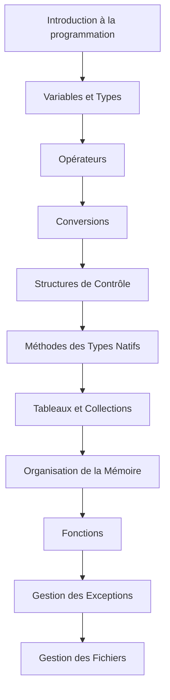

# Introduction à la programmation

## Concepts fondamentaux

- La programmation va de : **algorithme → langage de prog. → logiciel**
- Un **algorithme** est une suite finie et non-ambiguë d'**instructions** permettant de donner **la réponse à un problème**.
- Un **langage de programmation** est une notation conventionnelle destinée à formuler des algorithmes et à produire des programmes informatiques qui les appliquent.
- En informatique, un **logiciel** est un ensemble de séquences (= suite) d'instructions interprétables par une machine et d'un jeu de données nécessaires à ses opérations.
- Exemple en programmation :
  ```
  algorithme 
    → C#, Java, C++, Python, JS, ... 
    → prog.exe, un site web, ...
  ```

## Vocabulaire

- **Code source** : code écrit par un développeur dans le but d'obtenir un logiciel.
- **Compilation** : transformation du code source en un logiciel exécutable.
- **Exécution** : lancement du logiciel par le système d'exploitation (Windows, par exemple).
- **Erreur de syntaxe** : le code source ne correspond pas à la grammaire du langage utilisé.
- **Erreur de sémantique** : le programme peut être compilé mais lors de l'exécution il ne fait pas ce qui était prévu (c'est le « sens » du code qui n'est pas correct).

## Paradigmes multiples

- Un **paradigme** est une manière de penser.
- On peut programmer en voyant un code de plusieurs manières différentes :
  - **procédural** (programme = ensemble de procédures)
  - **orienté objet** (programme = ensemble d'objets qui se parlent)
  - **fonctionnel** (programme = ensemble de fonctions qui sont appelées les unes sur les autres)
  - **logique** (programme = règles et faits)
- Cet aspect influence le code produit, la méthode, etc.
- En C#, on peut utiliser le procédural, l'orienté objet et le fonctionnel.

## Version du C#

- Le C# évolue régulièrement, avec des nouveautés chaque année.
- Voici une liste des versions :

  | Version          | Année     | Nouveautés principales                                               |
  | ---------------- | --------- | -------------------------------------------------------------------- |
  | **C# 1.0**       | 2002      | Bases du langage orienté objet                                       |
  | **C# 1.2**       | 2003      | Amélioration du `foreach`                                            |
  | **C# 2.0**       | 2005      | Generics, types `nullable`, itérateurs                               |
  | **C# 3.0**       | 2007      | LINQ, lambdas, méthodes d’extension                                  |
  | **C# 4.0**       | 2010      | Type `dynamic`, paramètres nommés et optionnels                      |
  | **C# 5.0**       | 2012      | `async` / `await`, infos d’appelant                                  |
  | **C# 6.0**       | 2015      | Interpolation de chaînes, `nameof`, null-conditional                 |
  | **C# 7.0 – 7.3** | 2017–2018 | Tuples, pattern matching, fonctions locales, améliorations des `ref` |
  | **C# 8.0**       | 2019      | Types de référence nullable, `switch` expressions, `async streams`   |
  | **C# 9.0**       | 2020      | Records, `init` setters, top-level statements                        |
  | **C# 10.0**      | 2021      | `global using`, record structs, espaces de noms simplifiés           |
  | **C# 11.0**      | 2022      | Raw string literals, membres requis, modèles de liste                |
  | **C# 12.0**      | 2023      | Primary constructors, inline arrays, paramètres lambda facultatifs   |
  | **C# 13.0**      | 2024      | Améliorations `params`, `ref struct` en async, nouvelles syntaxes    |


## Format d'un programme C#

### .NET 5

```csharp
using System;

namespace MyFirstConsApp
{
    class Program
    {
        static void Main(string[] args)
        {
            Console.WriteLine("Hello World!");
        }
    }
}
```
- Le **framework** (technologie) propose des ressources dans un environnement hiérarchisé.

### A partir de .NET 6 

- Avec les mises à jour, il est possible de simplifier :
    ```csharp
    Console.WriteLine("Hello World!");
    ```

## Syntaxe générale du langage

- Il faut respecter les **majuscules** et **minuscules**.
- Chaque ligne de code se termine par un `;`
- Un bloc de code s'identifie **par des accolades** `{ ... }`
- On peut ajouter un commentaire avec `//`
- **camelCase** : façon d'écrire les variables (ex : `maVariable`)
- La **signature d'une fonction** est un ensemble d'informations qui définit comment une fonction peut être appelée dans le code :
    - Nom de la fonction
    - Type et nombre de paramètres
    - Type de retour de la fonction

Exemple en C# :
```csharp
void AfficherMessage(string message)
{
    Console.WriteLine(message);
}
```
- nom : `AfficherMessage`
- paramètre : `string message` (chaîne de char)
- type de retour : `void` (la fonction ne renvoie rien)

## Plan du cours

Le cours s'organise de façon progressive, des concepts les plus fondamentaux aux plus avancés.



Chaque chapitre s'appuie sur les connaissances des chapitres précédents, il est donc important de bien comprendre les concepts avant de passer au chapitre suivant.
