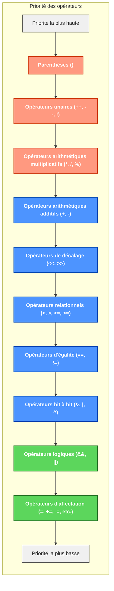

# Les opérateurs

Les opérateurs sont des symboles qui réalisent des opérations sur une ou plusieurs valeurs (appelées opérandes). Ils sont fondamentaux en programmation car ils permettent de manipuler les données.

## Opérateurs arithmétiques binaires

Les opérateurs arithmétiques binaires effectuent des calculs mathématiques de base sur deux opérandes et retournent un résultat numérique.

- `+` : addition (`a+b`)
- `-` : soustraction (`a-b`)
- `*` : multiplication (`a*b`)
- `/` : division (`a/b`) (le résultat d'une division entière de type `int` reste entier)
- `%` : modulo (`a%b`) - donne le reste de la division

::: tip Exemple
```csharp
int a = 10;
int b = 3;
Console.WriteLine(a + b);  // 13
Console.WriteLine(a - b);  // 7
Console.WriteLine(a * b);  // 30
Console.WriteLine(a / b);  // 3 (pas 3.33, car division entière)
Console.WriteLine(a % b);  // 1 (reste de la division)

// Avec des nombres décimaux, la division donne un résultat décimal
double c = 10.0;
double d = 3.0;
Console.WriteLine(c / d);  // 3.3333333333333335
```

::: warning Attention
Si vous divisez deux entiers (`int`), le résultat sera un entier (troncature). Si vous voulez un résultat décimal, au moins un des opérandes doit être de type décimal.
:::

## Opérateurs arithmétiques unaires

Ces opérateurs n'agissent que sur une seule opérande. Ils sont souvent utilisés pour incrémenter ou décrémenter des variables dans les boucles ou les compteurs.

- `++` : incrémentation (augmentation) (`a++` ou `++a`)
- `--` : décrémentation (diminution) (`a--` ou `--a`)
- `x++` (post-incrémentation) : d'abord utiliser la valeur, puis incrémenter.
- `++x` (pré-incrémentation) : incrémenter d'abord, puis utiliser la nouvelle valeur de x.

::: tip Exemple
```csharp
// Post-incrémentation vs pré-incrémentation
int a = 5;
int b = a++; // b = 5, puis a devient 6
Console.WriteLine($"a = {a}, b = {b}"); // a = 6, b = 5

int c = 5;
int d = ++c; // c devient 6, puis d = 6
Console.WriteLine($"c = {c}, d = {d}"); // c = 6, d = 6

// Utilisation dans une boucle
int i = 0;
while (i < 3) {
    Console.WriteLine(i++); // Affiche 0, 1, 2
}
```
:::

## Opérateurs arithmétiques avec affectation

Ces opérateurs combinent une opération arithmétique et une affectation en une seule instruction. Ils sont utiles pour raccourcir le code et le rendre plus lisible, surtout quand on modifie la même variable plusieurs fois.

- `+=` : affectation de l'entier par addition (`a+=b` identique à `a = a + b`)
- `-=` : affectation de l'entier par soustraction (`a-=b` identique à `a = a - b`)
- `*=` : affectation de l'entier par multiplication (`a*=b` identique à `a = a * b`)
- `/=` : affectation de l'entier par division (`a/=b` identique à `a = a / b`)
- `%=` : affectation de l'entier par modulo (`a%=b` identique à `a = a % b`)

::: tip Exemple
```csharp
int score = 0;

// Ajoute 10 points
score += 10; // équivalent à score = score + 10;
Console.WriteLine($"Score: {score}"); // 10

// Double les points
score *= 2; // équivalent à score = score * 2;
Console.WriteLine($"Score: {score}"); // 20

// Enlève 5 points
score -= 5; // équivalent à score = score - 5;
Console.WriteLine($"Score: {score}"); // 15

// Divise par 3
score /= 3; // équivalent à score = score / 3;
Console.WriteLine($"Score: {score}"); // 5
```
:::

## Opérateurs relationnels

Les opérateurs relationnels permettent de comparer des valeurs et de déterminer la relation entre elles. Ils sont essentiels pour les structures de contrôle comme les conditions `if` et les boucles `while`.

- `==` : comparaison d'égalité (`a == b`)
- `!=` : comparaison de différence (`a != b`)
- `>` : comparaison de plus grand que (`a > b`)
- `>=` : plus grand ou égal à (`a >= b`)
- `<` : plus petit que (`a < b`)
- `<=` : plus petit ou égal à (`a <= b`)

Ces opérateurs donnent un résultat booléen (`true` ou `false`). Ils sont couramment utilisés dans les instructions conditionnelles (`if`, ...).

::: tip Exemple
```csharp
int age = 20;
bool estMajeur = age >= 18; // true
Console.WriteLine($"Est majeur: {estMajeur}");

// Dans une condition if
if (age > 18) {
    Console.WriteLine("Plus de 18 ans");
} else if (age == 18) {
    Console.WriteLine("Exactement 18 ans");
} else {
    Console.WriteLine("Moins de 18 ans");
}

// Comparaison de chaînes
string nom1 = "Alice";
string nom2 = "Bob";
bool memePrenoms = nom1 == nom2; // false
Console.WriteLine($"Même prénoms: {memePrenoms}");
```

::: warning Attention
Pour comparer l'égalité, utilisez toujours `==` (double égal) et non `=` (simple égal) qui sert à affecter une valeur.
:::

## Opérateurs logiques

Les opérateurs logiques permettent de combiner ou de modifier des expressions booléennes (true/false). Ils sont utilisés pour créer des conditions complexes et sont essentiels dans la logique de programmation.

- `&&` : "et logique" (`a && b`) - renvoie true si les deux conditions sont vraies
- `||` : "ou logique" (`a || b`) - renvoie true si au moins une condition est vraie
- `!` : "non logique" (`!a`) - inverse la valeur booléenne (true devient false et vice versa)

Ces opérateurs sont souvent utilisés avec les opérateurs relationnels pour construire des conditions complexes.

::: tip Exemple
```csharp
int age = 20;
string pays = "Belgique";

// ET logique - les deux conditions doivent être vraies
if (age >= 18 && pays == "Belgique") {
    Console.WriteLine("Majeur en Belgique");
}

// OU logique - au moins une condition doit être vraie
bool promotion = age < 12 || age >= 65;
Console.WriteLine($"Éligible à la promotion: {promotion}");

// NON logique - inverse la condition
bool estMineur = !(age >= 18); // équivalent à age < 18
Console.WriteLine($"Est mineur: {estMineur}");

// Combinaisons complexes
if ((age >= 18 && pays == "Belgique") || (age >= 21 && pays == "USA")) {
    Console.WriteLine("Majeur selon les critères locaux");
}
```

::: warning Évaluation à court-circuit
L'opérateur `&&` n'évalue pas la seconde condition si la première est déjà fausse.
L'opérateur `||` n'évalue pas la seconde condition si la première est déjà vraie.
:::

## Opérateurs logiques bit à bit

Ces opérateurs agissent sur la représentation binaire (en bits) des nombres. Ils sont utiles pour les manipulations de bas niveau, le travail avec des masques de bits et l'optimisation.

- `<<` : décalage à gauche (`a << b`) - multiplie a par 2^b
- `>>` : décalage à droite (`a >> b`) - divise a par 2^b
- `~` : négation binaire (`~a`) - inverse tous les bits
- `&` : "et binaire" (`a & b`) - bit à 1 si les deux bits correspondants sont à 1
- `|` : "ou binaire" (`a | b`) - bit à 1 si au moins un des bits correspondants est à 1
- `^` : "ou exclusif binaire" (`a ^ b`) - bit à 1 si exactement un des bits correspondants est à 1

::: tip Exemple
```csharp
// Représentation en bits de 5: 00000101
// Représentation en bits de 3: 00000011

int a = 5;
int b = 3;

// Décalage à gauche (multiplie par 2^n)
int decalageGauche = a << 1; // 5 * 2 = 10 (00001010)
Console.WriteLine($"5 << 1 = {decalageGauche}");

// Décalage à droite (divise par 2^n)
int decalageDroite = a >> 1; // 5 / 2 = 2 (00000010)
Console.WriteLine($"5 >> 1 = {decalageDroite}");

// ET binaire (1 si les deux bits sont 1)
int etBinaire = a & b; // 00000101 & 00000011 = 00000001 = 1
Console.WriteLine($"5 & 3 = {etBinaire}");

// OU binaire (1 si au moins un bit est 1)
int ouBinaire = a | b; // 00000101 | 00000011 = 00000111 = 7
Console.WriteLine($"5 | 3 = {ouBinaire}");

// OU exclusif (1 si un seul bit est 1)
int ouExclusif = a ^ b; // 00000101 ^ 00000011 = 00000110 = 6
Console.WriteLine($"5 ^ 3 = {ouExclusif}");

// Négation binaire (inverse tous les bits)
int negation = ~a; // ~00000101 = 11111010 (représentation complément à 2)
Console.WriteLine($"~5 = {negation}");
```
:::

## Opérateurs de chaînes de caractères

Les opérateurs pour les chaînes de caractères permettent de comparer, concaténer et manipuler du texte. En C#, les chaînes sont des objets qui offrent également de nombreuses méthodes pour leur manipulation.

- `string1 == string2` : comparaison d'égalité
- `string1 != string2` : comparaison de différence
- `string1 + string2` : concaténation (fusion) de chaînes
- `$"..."` : chaîne d'interpolation (permet d'insérer des variables dans du texte)

::: tip Exemple
```csharp
string prenom = "Alice";
string nom = "Dupont";

// Concaténation
string nomComplet = prenom + " " + nom;
Console.WriteLine(nomComplet); // "Alice Dupont"

// Comparaison
bool memeNom = nom == "Dupont"; // true
Console.WriteLine($"Même nom: {memeNom}");

// Interpolation de chaîne
string presentation = $"Je m'appelle {prenom} {nom} et j'ai {25} ans.";
Console.WriteLine(presentation);

// Autres opérations sur les chaînes (méthodes)
string majuscules = prenom.ToUpper();
Console.WriteLine(majuscules); // "ALICE"

bool contientA = prenom.Contains("A"); // true
Console.WriteLine($"Contient 'A': {contientA}");

string sousChaine = nom.Substring(0, 2);
Console.WriteLine(sousChaine); // "Du"
```

::: warning Attention
La comparaison des chaînes avec `==` est sensible à la casse. Pour une comparaison insensible à la casse, utilisez `string.Equals(s1, s2, StringComparison.OrdinalIgnoreCase)`.
:::

## Priorité des opérateurs

La priorité des opérateurs détermine l'ordre dans lequel les expressions sont évaluées. Comprendre cette priorité est essentiel pour éviter des erreurs de logique dans vos programmes.



::: tip Exemple de priorité
```csharp
// Sans parenthèses - multiplication effectuée avant addition
int resultat1 = 2 + 3 * 4;
Console.WriteLine(resultat1); // 14

// Avec parenthèses - addition effectuée avant multiplication
int resultat2 = (2 + 3) * 4;
Console.WriteLine(resultat2); // 20

// Combinaison complexe
int x = 5;
int y = 3;
int z = 2;
bool test = x > y + z && !(z < 0);
Console.WriteLine($"Le test est: {test}"); // true
// évalué comme: (x > (y + z)) && (!(z < 0))
```
:::

::: warning Conseil
En cas de doute sur la priorité des opérateurs, utilisez des parenthèses pour rendre votre code plus lisible et éviter les erreurs.
:::

## Résumé des opérateurs

| Catégorie | Opérateurs | Utilisation |
|-----------|------------|-------------|
| Arithmétiques | `+`, `-`, `*`, `/`, `%`, `++`, `--` | Calculs mathématiques |
| Affectation | `=`, `+=`, `-=`, `*=`, `/=`, `%=` | Assigner des valeurs |
| Relationnels | `==`, `!=`, `<`, `>`, `<=`, `>=` | Comparer des valeurs |
| Logiques | `&&`, `||`, `!` | Combiner des conditions |
| Bit à bit | `&`, `|`, `^`, `~`, `<<`, `>>` | Manipuler des bits |
| Chaînes | `+`, `==`, `!=` | Manipuler du texte |
