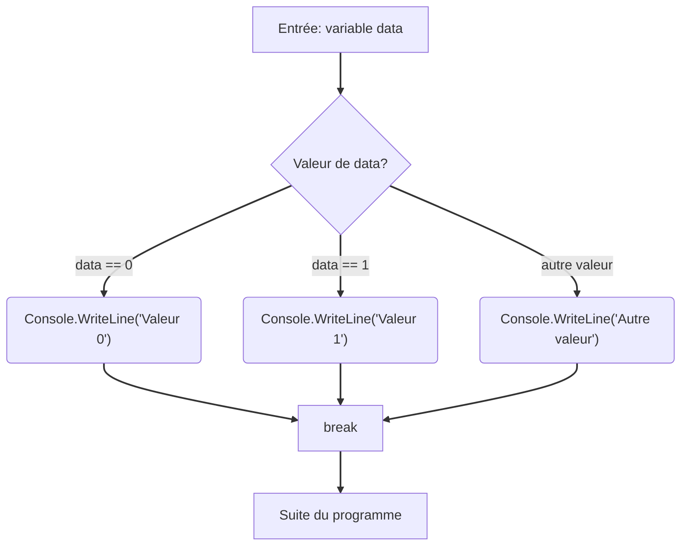

# Structures de contrôle

## Condition : if ... else

- `if` est une instruction qui permet d'exécuter un bloc de code si une condition est vraie.
- `else` permet d'exécuter un bloc si la condition est fausse, utilisé avec if.

- **Exemple :**
  ```csharp
  if (age >= 18)
  {
      Console.WriteLine("Vous êtes majeur(e)");
  }
  else
  {
      Console.WriteLine("Vous êtes mineur(e)");
  }
  ```

## Instruction switch ... case

- Le **switch** permet de choisir entre plusieurs options en fonction de la valeur d'une variable.
- Le **break** est essentiel pour terminer l'exécution d'un case et éviter que le programme n'exécute les instructions des cases suivants.

  ```csharp
  switch (data)
  {
      case 0:
          Console.WriteLine("Valeur 0");
          break;
      case 1:
          Console.WriteLine("Valeur 1");
          break;
      default:
          Console.WriteLine("Autre valeur");
          break;
  }  ```

- Ici, selon la valeur de `data`, le programme affiche un message différent.

### Représentation du flux de contrôle dans un switch-case



## Boucles

### Boucle for

Utilisée lorsque le nombre d'itérations est connu à l'avance.
```csharp
for (int i = 0; i < 5; i++)
{
    Console.WriteLine(i);
}
```

### Boucle while

Répète tant qu'une condition est vraie, testée AVANT chaque itération.
```csharp
int i = 0;
while (i < 5)
{
    Console.WriteLine(i);
    i++;
}
```

### Boucle do...while

Comme while, mais la condition est vérifiée APRES l'exécution du bloc (donc le bloc s'exécute au moins une fois).
```csharp
int i = 0;
do
{
    Console.WriteLine(i);
    i++;
} while (i < 5);
```

### Boucle foreach

Utilisée pour parcourir les éléments d'une collection (tableau, liste) sans se soucier de l'index.
```csharp
string[] mois = new string[] { "janvier", "février" };
foreach (string data in mois)
{
    Console.WriteLine(data);
}
```

::: tip Comparaison des boucles
- **for** : Quand vous connaissez le nombre exact d'itérations
- **while** : Quand vous ne savez pas combien de fois vous devez itérer
- **do-while** : Quand vous voulez que le bloc s'exécute au moins une fois
- **foreach** : Pour parcourir tous les éléments d'une collection
:::

## Instructions de contrôle de flux

- **break** : Sort immédiatement de la boucle ou du switch
- **continue** : Passe directement à la prochaine itération de la boucle
- **return** : Sort de la méthode actuelle (et renvoie une valeur si nécessaire)
