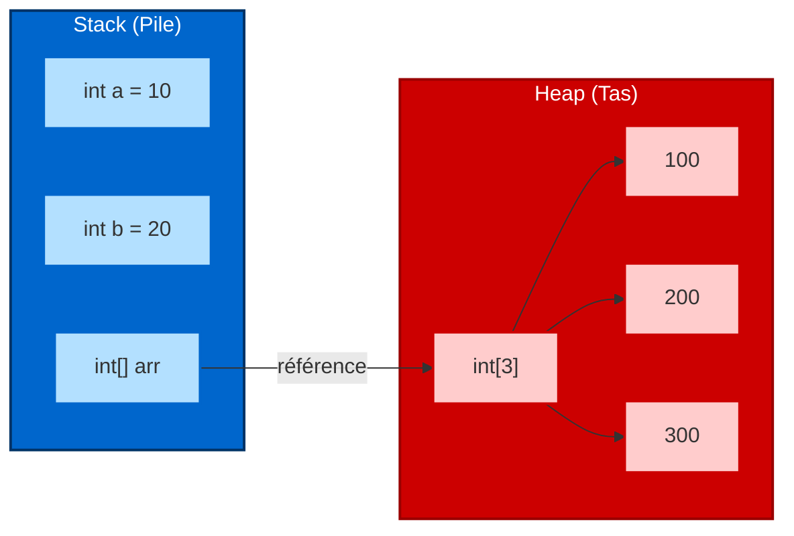
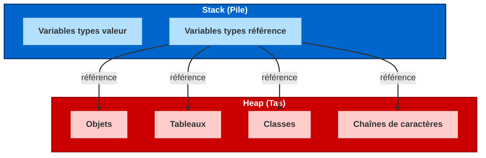

# L'organisation de la mémoire

## La pile (stack)

1. La pile est organisée sous la forme **LIFO** (Last In First Out) : le dernier élément ajouté est le premier retiré (comme une pile de livres).
2. On y stocke les types de données **simples** (`int`, `char`, `bool`), avec taille fixe et connue.
3. **Gestion du programme** : la pile contient des informations comme les variables locales de fonctions. Quand une fonction est appelée, ses variables sont ajoutées à la pile.
4. **Arguments des fonctions** : les valeurs passées à une fonction y sont aussi stockées localement.
5. **Taille limitée** : souvent ~1Mo. Dépasser donne un "dépassement de pile".

::: warning Stack Overflow
Une erreur de type "Stack Overflow" (débordement de pile) se produit quand la pile est pleine, souvent à cause d'une récursion infinie ou trop profonde.
:::

## Le tas (heap)

1. Utilisé pour stocker les **données grandes et complexes** (tableaux, objets).
2. **Taille flexible** : pas de limite stricte.
3. **Distingué par "new"** : on range sur le tas en créant des objets avec `new`.
4. **Nettoyage automatique** via le **garbage collector (GC)** : quand des données ne sont plus utilisées, GC les libère.

```csharp
int[] data = new int[20]; // référence data sur la pile, tableau sur le tas
```

## Le garbage collector

- Tant qu'une donnée sur le tas est référencée, elle ne sera pas supprimée.
- Dès qu'elle n'est plus référencée, elle peut être libérée par le GC.
- L'appel au GC est **automatique** mais peut être forcé :
  ```csharp
  int[] data = new int[20];
  data = null; // plus référencé
  GC.Collect(); // appel forcé au GC
  ```

## Les références multiples

- Plusieurs variables peuvent pointer vers le même objet sur le tas. L'objet reste en mémoire tant qu'une référence y pointe.
- Mettre une variable à `null` ne supprime pas l'objet s'il est encore référencé ailleurs.

```csharp
int[] data1 = new int[20];
int[] data2 = data1;
data1 = null;
GC.Collect(); // tableau reste car data2 le pointe
Console.WriteLine(data2[17]);
```

## Représentation visuelle

::: info Organisation de la mémoire en C#



Dans cet exemple :
- Les variables simples `a` et `b` sont stockées sur la pile
- Le tableau est créé sur le tas
- La variable `arr` sur la pile contient une référence (adresse mémoire) vers le tableau sur le tas
:::

### Vue conceptuelle de l'allocation mémoire



## Implications pour la programmation

- **Variables valeur** (stockées sur la pile) sont plus rapides d'accès
- **Variables référence** (pointant vers le tas) sont plus flexibles pour des données complexes
- Comprendre cette organisation aide à debugger les problèmes de mémoire
- Le mécanisme de "passage par référence" vs "passage par valeur" s'explique par cette organisation
