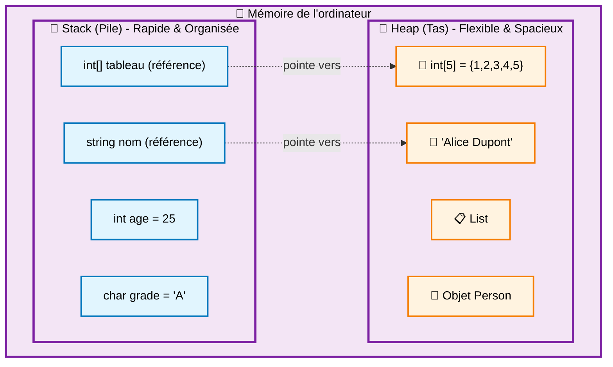

# L'organisation de la mémoire

## Introduction : Pourquoi comprendre la mémoire ?

Imaginez votre ordinateur comme une grande bibliothèque. Pour fonctionner efficacement, il faut organiser les livres (vos données) de manière logique. C# utilise deux zones principales pour stocker vos données : **la pile (stack)** et **le tas (heap)**.

Comprendre cette organisation vous aidera à :
- 🎯 Écrire du code plus efficace
- 🐛 Déboguer plus facilement vos erreurs
- 💡 Comprendre pourquoi certains programmes sont lents
- 🔧 Éviter les problèmes de mémoire

## La pile (Stack) : Le bureau bien rangé

### Concept de base

La pile fonctionne comme une **pile de livres** sur votre bureau :

```csharp
// Quand vous déclarez des variables simples
int age = 25;        // Livre n°1 posé sur le bureau
char grade = 'A';    // Livre n°2 posé sur le livre n°1
bool isActive = true; // Livre n°3 posé sur le livre n°2

// Pour accéder au grade, il faut d'abord retirer isActive
// C'est le principe LIFO : Last In, First Out
```

### Caractéristiques principales

1. **Organisation LIFO** (Last In First Out) : 
   - Le dernier élément ajouté est le premier retiré
   - Comme une pile de livres : vous prenez toujours celui du dessus

2. **Types de données stockées** :
   - Types **simples** : `int`, `char`, `bool`, `double`, `float`
   - **Références** vers les objets du tas
   - **Variables locales** des fonctions

3. **Rapidité d'accès** :
   - Très rapide car l'accès se fait toujours "au sommet"
   - Pas besoin de chercher dans toute la mémoire

4. **Taille limitée** :
   - Généralement ~1-8 Mo selon le système
   - Suffisant pour les variables simples et les appels de fonctions

### Exemple concret avec une fonction

```csharp
static void Main()
{
    int x = 10;        // x va sur la pile
    int y = 20;        // y va sur la pile
    
    int resultat = Additionner(x, y);  // Appel de fonction
    
    Console.WriteLine(resultat);
}

static int Additionner(int a, int b)
{
    int somme = a + b;  // Les paramètres a, b et la variable somme
                        // sont ajoutés temporairement sur la pile
    return somme;       // Quand la fonction se termine,
                        // a, b et somme sont retirés de la pile
}
```

::: warning Stack Overflow - Débordement de pile
Une erreur "Stack Overflow" se produit quand la pile est pleine. Causes principales :
- **Récursion infinie** : une fonction qui s'appelle indéfiniment
- **Récursion trop profonde** : trop d'appels de fonctions imbriqués
- **Variables locales trop volumineuses** : évitez de déclarer de gros tableaux comme variables locales

```csharp
// ❌ Exemple de récursion infinie (provoque Stack Overflow)
static void FonctionDangereuse()
{
    FonctionDangereuse(); // S'appelle indéfiniment !
}
```
:::

## Le tas (Heap) : L'entrepôt flexible

### Concept de base

Le tas est comme un **grand entrepôt** où vous pouvez stocker des objets de toutes tailles, partout où il y a de la place.

```csharp
// Création d'objets sur le tas avec le mot-clé "new"
int[] nombres = new int[1000];     // Tableau de 1000 entiers
string message = "Bonjour tout le monde!";  // Chaîne de caractères
List<string> noms = new List<string>();     // Liste dynamique
```

### Caractéristiques principales

1. **Stockage flexible** :
   - Objets de taille variable
   - Pas d'ordre particulier de rangement
   - Accès par adresse mémoire (référence)

2. **Types de données stockées** :
   - **Tableaux** : `int[]`, `string[]`, etc.
   - **Objets** : instances de classes
   - **Collections** : `List<T>`, `Dictionary<K,V>`, etc.
   - **Chaînes de caractères** : `string`

3. **Taille flexible** :
   - Limité par la RAM disponible
   - Peut grandir selon les besoins du programme

4. **Gestion automatique** :
   - Le **Garbage Collector** nettoie automatiquement
   - Pas besoin de libérer manuellement la mémoire

### Le système de références

```csharp
// Création d'un tableau sur le tas
int[] tableau1 = new int[5] {1, 2, 3, 4, 5};

// tableau1 (sur la pile) contient l'ADRESSE du tableau (sur le tas)
// C'est comme avoir l'adresse d'un entrepôt sur un post-it
```

## Le Garbage Collector (GC) : Le service de nettoyage

### Comment ça fonctionne

Le Garbage Collector est comme un **service de nettoyage automatique** qui :

1. **Surveille** quels objets sont encore utilisés
2. **Identifie** les objets abandonnés (plus de références)
3. **Libère** automatiquement la mémoire de ces objets

### Exemple pratique

```csharp
static void DemoGarbageCollector()
{
    // Étape 1 : Création d'un tableau
    int[] monTableau = new int[1000];
    // monTableau (pile) → tableau de 1000 entiers (tas)
    
    // Étape 2 : Utilisation normale
    monTableau[0] = 42;
    Console.WriteLine(monTableau[0]);
    
    // Étape 3 : Abandon de la référence
    monTableau = null;
    // Plus aucune variable ne pointe vers le tableau
    
    // Étape 4 : Le GC peut maintenant libérer le tableau
    GC.Collect(); // Force le nettoyage (généralement automatique)
    
    // Le tableau a été supprimé de la mémoire !
}
```

### Références multiples

```csharp
static void DemoReferencesMultiples()
{
    // Création d'un tableau
    int[] original = new int[3] {10, 20, 30};
    
    // Création d'une deuxième référence vers le MÊME tableau
    int[] copieReference = original;
    
    // Les deux variables pointent vers le même objet !
    original[0] = 999;
    Console.WriteLine(copieReference[0]); // Affiche 999 !
    
    // Suppression d'une référence
    original = null;
    
    // Le tableau existe encore car copieReference le pointe toujours
    Console.WriteLine(copieReference[0]); // Affiche encore 999
    
    // Suppression de la dernière référence
    copieReference = null;
    
    // Maintenant le GC peut libérer le tableau
}
```

## Représentation visuelle de la mémoire

::: info Organisation complète de la mémoire en C#


:::

### Exemple détaillé avec code

```csharp
static void ExempleComplet()
{
    // === Variables sur la PILE ===
    int compteur = 0;           // Pile : valeur directe
    bool estActif = true;       // Pile : valeur directe
    
    // === Objets sur le TAS ===
    int[] scores = new int[3];  // Pile : référence → Tas : tableau
    string nom = "Jean";        // Pile : référence → Tas : chaîne
    
    // === Modification des données ===
    scores[0] = 95;            // Modifie le tableau sur le tas
    scores[1] = 87;
    scores[2] = 92;
    
    // === Création d'une référence supplémentaire ===
    int[] autreRef = scores;   // Deux références vers le même tableau
    
    Console.WriteLine($"Score via scores[0]: {scores[0]}");
    Console.WriteLine($"Score via autreRef[0]: {autreRef[0]}");
    // Les deux affichent 95 car ils pointent vers le même objet !
}
```

## Comparaison Stack vs Heap

| Aspect | 🏢 Stack (Pile)            | 🏪 Heap (Tas) |
|--------|----------------------------|---------------|
| **Vitesse** | ⚡ Très rapide              | 🐌 Plus lent |
| **Taille** | 📏 Limitée (~1-8 Mo)       | 📈 Flexible (RAM disponible) |
| **Organisation** | 📚 LIFO (ordonnée)         | 🎲 Libre (désordonnée) |
| **Types stockés** | `int`, `bool`, `char`, ... | Tableaux, objets, strings |
| **Gestion** | 🔄 Automatique (scope)     | 🧹 Garbage Collector |
| **Durée de vie** | ⏰ Limitée au scope         | 🕰️ Jusqu'à plus de références |

## Implications pratiques pour vos programmes

### Bonnes pratiques

1. **Utilisez la pile pour** :
   ```csharp
   int age = 25;              // Simple et rapide
   bool isValid = true;       // Accès instantané
   char grade = 'A';          // Pas de gestion mémoire
   ```

2. **Utilisez le tas pour** :
   ```csharp
   int[] donnees = new int[1000];     // Données volumineuses
   List<string> noms = new List<string>(); // Collections dynamiques
   string texte = "Long texte...";    // Chaînes de caractères
   ```

3. **Évitez les fuites mémoire** :
   ```csharp
   // ✅ Bon : libération automatique
   void TraiterDonnees()
   {
       int[] temp = new int[1000];
       // ... traitement ...
       // temp sera automatiquement libéré en fin de fonction
   }
   
   // ⚠️ Attention : référence globale
   static int[] donneesGlobales; // Restera en mémoire jusqu'à la fin du programme
   ```

### Déboguer les problèmes de mémoire

1. **Stack Overflow** :
   ```csharp
   // Problème : récursion infinie
   static int CalculerFactorielle(int n)
   {
       return n * CalculerFactorielle(n - 1); // ❌ Pas de condition d'arrêt !
   }
   
   // Solution : ajouter une condition d'arrêt
   static int CalculerFactorielle(int n)
   {
       if (n <= 1) return 1; // ✅ Condition d'arrêt
       return n * CalculerFactorielle(n - 1);
   }
   ```

2. **Références nulles** :
   ```csharp
   int[] tableau = new int[5];
   tableau = null;
   Console.WriteLine(tableau[0]); // ❌ NullReferenceException !
   
   // Solution : vérifier avant d'utiliser
   if (tableau != null)
   {
       Console.WriteLine(tableau[0]); // ✅ Sécurisé
   }
   ```

## Exercices pratiques

### Exercice 1 : Identifier le stockage

Pour chaque déclaration, indiquez si la donnée est stockée sur la pile ou le tas :

```csharp
int nombre = 42;                    // Réponse : ?
string nom = "Alice";               // Réponse : ?
int[] tableau = new int[10];        // Réponse : ?
bool estValide = true;              // Réponse : ?
List<int> liste = new List<int>();  // Réponse : ?
```

<details>
<summary>🔍 Cliquez pour voir les réponses</summary>

```csharp
int nombre = 42;                    // Réponse : PILE (type simple)
string nom = "Alice";               // Réponse : TAS (chaîne de caractères) + référence sur la PILE
int[] tableau = new int[10];        // Réponse : TAS (tableau) + référence sur la PILE
bool estValide = true;              // Réponse : PILE (type simple)
List<int> liste = new List<int>();  // Réponse : TAS (objet collection) + référence sur la PILE
```

**Explications détaillées :**

- `int nombre = 42` : Les types simples (`int`, `bool`, `char`, etc.) sont stockés directement sur la **pile**
- `string nom = "Alice"` : Les chaînes de caractères sont des objets stockés sur le **tas**, mais la référence est sur la **pile**
- `int[] tableau = new int[10]` : Tout ce qui est créé avec `new` va sur le **tas**, la référence est sur la **pile**
- `bool estValide = true` : Type simple, donc sur la **pile**
- `List<int> liste = new List<int>()` : Objet créé avec `new`, donc sur le **tas**, référence sur la **pile**

</details>

### Exercice 2 : Suivre les références

```csharp
int[] a = new int[] {1, 2, 3};
int[] b = a;
a[0] = 999;
Console.WriteLine(b[0]); // Que va afficher ce code ?

a = null;
Console.WriteLine(b[0]); // Et maintenant ?
```

<details>
<summary>🔍 Cliquez pour voir les réponses</summary>

**Réponses :**

```csharp
int[] a = new int[] {1, 2, 3};  // Création d'un tableau sur le tas
int[] b = a;                    // b pointe vers le MÊME tableau que a
a[0] = 999;                     // Modification du tableau via a
Console.WriteLine(b[0]);        // Affiche 999 (même objet !)

a = null;                       // a ne pointe plus vers le tableau
Console.WriteLine(b[0]);        // Affiche encore 999 (b pointe toujours vers le tableau)
```

**Explication étape par étape :**

1. **Étape 1** : `int[] a = new int[] {1, 2, 3}`
   - Un tableau est créé sur le **tas** avec les valeurs [1, 2, 3]
   - La variable `a` (sur la pile) contient l'adresse de ce tableau

2. **Étape 2** : `int[] b = a`
   - La variable `b` reçoit la **même adresse** que `a`
   - Maintenant `a` et `b` pointent vers le **même tableau** sur le tas

3. **Étape 3** : `a[0] = 999`
   - Modification du premier élément du tableau via `a`
   - Le tableau devient [999, 2, 3]

4. **Étape 4** : `Console.WriteLine(b[0])`
   - Affiche **999** car `b` pointe vers le même tableau modifié

5. **Étape 5** : `a = null`
   - `a` ne pointe plus vers le tableau
   - Le tableau existe encore car `b` le pointe toujours

6. **Étape 6** : `Console.WriteLine(b[0])`
   - Affiche encore **999** car le tableau n'a pas été détruit

**Schéma visuel :**
```
Étapes 1-2:  a ──┐
              b ──┴──> [1, 2, 3] (sur le tas)

Étape 3:     a ──┐
              b ──┴──> [999, 2, 3] (sur le tas)

Étapes 5-6:  a ──> null
              b ────> [999, 2, 3] (sur le tas)
```

</details>

## Résumé des concepts clés

🔑 **Points essentiels à retenir** :

1. **Stack (Pile)** = Données simples, rapides, limitées en taille
2. **Heap (Tas)** = Objets complexes, flexibles, gérés par le GC
3. **Références** = Adresses qui pointent du stack vers le heap
4. **Garbage Collector** = Nettoyage automatique des objets abandonnés
5. **Performance** = Stack plus rapide, Heap plus flexible

Cette compréhension vous permettra d'écrire du code C# plus efficace et de mieux comprendre le comportement de vos programmes ! 🚀
