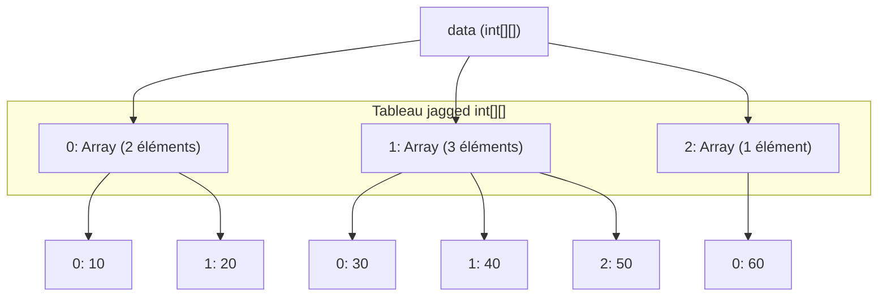
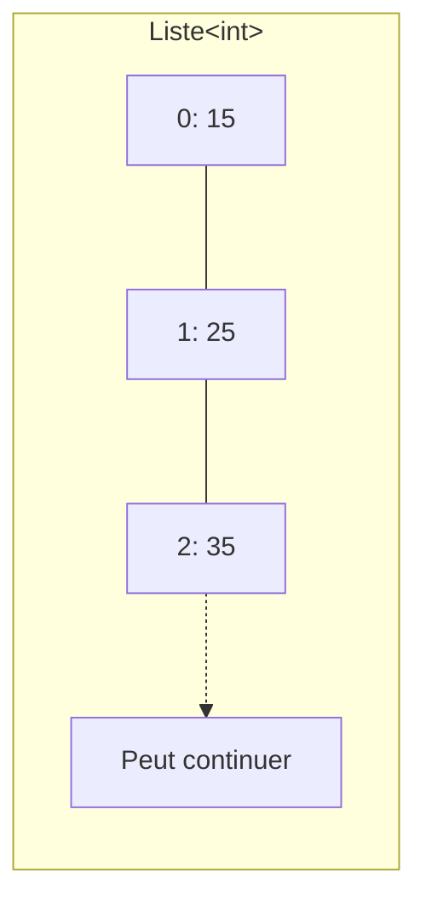

# Tableaux et collections

## Les tableaux

- Un **tableau** est une collection d'éléments du même type. L'accès se fait par **index**.
- **Déclaration** :
  ```csharp
  int[] data = new int[20];
  string[] mois = new string[] { "janvier", "février" };
  ```
- **Index** : commence à 0 (`data[0]` pour le premier élément).
- Modifier un élément par l'index : `data[1] = 25;`
- **Attention** : l'index ne doit **jamais** dépasser la taille du tableau.
- Pour la taille d'un tableau :  
  `data.Length`

## Les tableaux à plusieurs dimensions

- Un tableau à deux dimensions a un nombre fixe de lignes et de colonnes.

```csharp
// Tableau 2D (3 lignes x 4 colonnes)
int[,] matrice = new int[3, 4];
matrice[0, 0] = 1;  // Première ligne, première colonne
```

- Tableaux 3D ou plus:
```csharp
int[,,] cube = new int[3, 4, 5];
cube[0, 0, 0] = 1;  // Coordonnées x=0, y=0, z=0
```

- Tableaux de tableaux ("jagged array") - tailles variables:
```csharp
int[][] irregulier = new int[3][];
irregulier[0] = new int[4];
irregulier[1] = new int[2];
irregulier[2] = new int[5];
```

- Pour connaître le nombre de dimensions : `tab.Rank`
- Pour la taille d'une dimension : `tab.GetLength(0)`

::: tip Conseil
`var` est à éviter pour déclarer un tableau pour des raisons de clarté.
:::

## Les tuples

- Un **tuple** est une collection d'éléments de différents types. Contrairement aux tableaux qui contiennent des éléments du même type, un tuple peut stocker plusieurs types. La taille du tuple est fixée à la création.

**Syntaxe :**  
```csharp
(Type1, Type2, ...) monTuple = (valeur1, valeur2, ...);
```

- On peut donner des noms aux valeurs :
  ```csharp
  (int age, string nom) personne = (age: 30, nom: "Alice");
  ```
- On peut accéder par position : `personne.Item1`
- Ou par nom : `personne.nom`

## Les collections

- Une **collection** est une structure de données pouvant contenir des éléments du même type.
- Types de collections en C# :
  - Tableaux (`[]`)
  - Listes (`List`)
  - Ensembles (`Set`)
  - Maps (`HashMap`)
  - ...

## Les listes

- Une **liste** en C# est une collection d'éléments du même type, dynamique (on peut ajouter ou supprimer des éléments facilement).
- Création :
  ```csharp
  List<int> liste = new List<int>();
  List<string> liste = new List<string>();
  ```

- Les chevrons `< >` indiquent le type d'éléments.
- Ajouter/retirer :  
  ```csharp
  maListe.Add(42);
  maListe.Remove(42);
  ```
- Accès :  
  `maListe[0]`  
  Nombre d'éléments : `maListe.Count`

### Parcourir une liste
- Avec une boucle `for` :
  ```csharp
  for (int i = 0; i < maListe.Count; i++)
  {
      // faire qqch avec maListe[i]
  }
  ```
- Avec une boucle `foreach` :
  ```csharp
  foreach (int item in maListe)
  {
      // faire qqch avec item
  }
  ```

## Liste VS Tableau

|     | Liste                       | Tableau                        |
|-----|-----------------------------|--------------------------------|
| 1   | taille dynamique            | taille fixe                    |
| 2   | créé avec `List<T>`         | créé avec `T[]`                |
| 3   | Add(), Remove(), Contains() | pas vraiment de méthodes dispo |
| 4   | légèrement plus lent        | plus rapide (performance)      |
| 5   | modifs fréquentes, flexible | mieux quand taille/contenu const. |

### Représentation visuelle des collections

#### Tableau à une dimension  

```csharp
    int[] data = new int[3] { 15, 25, 35 };
```

| Index | Valeur |
|-------|--------|
| 0     | 15     |
| 1     | 25     |
| 2     | 35     |

#### Tableau à deux dimensions 

```csharp 
int[,] data = new int[3, 2] { { 10, 20 }, { 30, 40 }, { 50, 60 } };
```

|         | Colonne 0 | Colonne 1 |
|---------|-----------|-----------|
| Ligne 0 |    10     |    20     |
| Ligne 1 |    30     |    40     |
| Ligne 2 |    50     |    60     |

#### Jagged array (tableau irrégulier)

```csharp 
int[][] data = new int[3][] { 
    new int[2] { 10, 20 }, 
    new int[3] { 30, 40, 50 }, 
    new int[1] { 60 } 
}; 
```




### Liste 

```csharp
List<int> data = new List<int>() { 15, 25, 35 };
```




## Quelques fonctions utiles

- `a.CompareTo(b)` : Compare deux chaînes ou objets (renvoie 0 si égal, <0 si a < b, >0 si a > b).
- `string[] mots = phrase.Split(' ')` : sépare une chaîne et place les éléments dans un tableau.
- `DateTime.Now.Year` : donne l'année en cours.
- `string.Join(",", numbers)` : crée une chaîne avec les éléments d'une liste séparés par des virgules.
