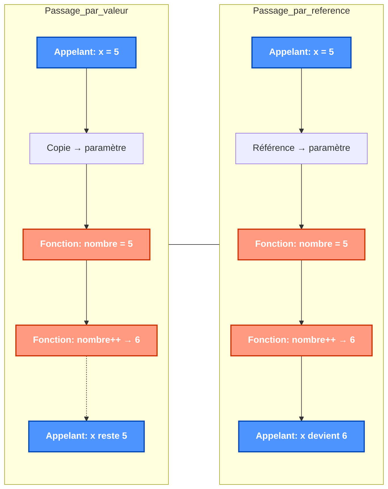
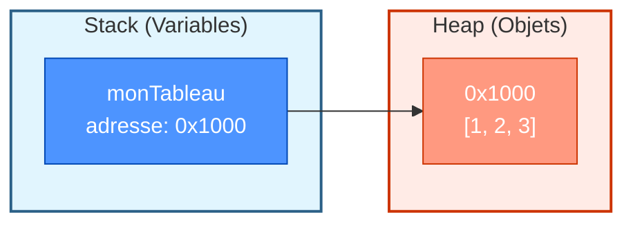
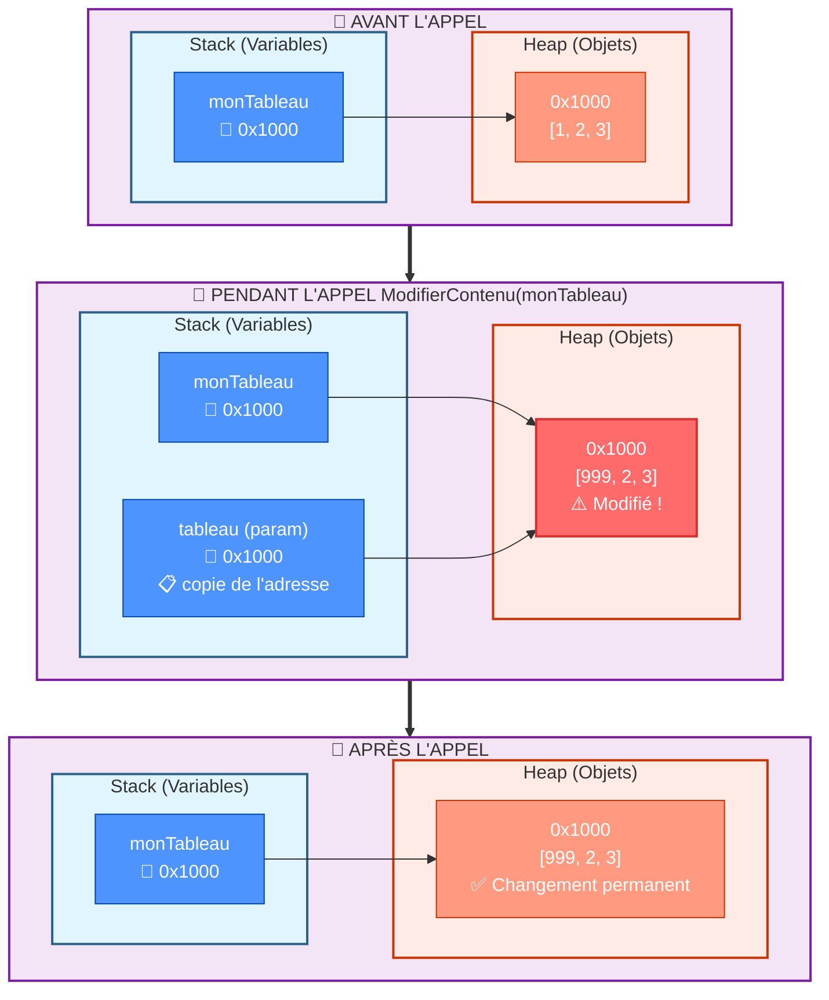
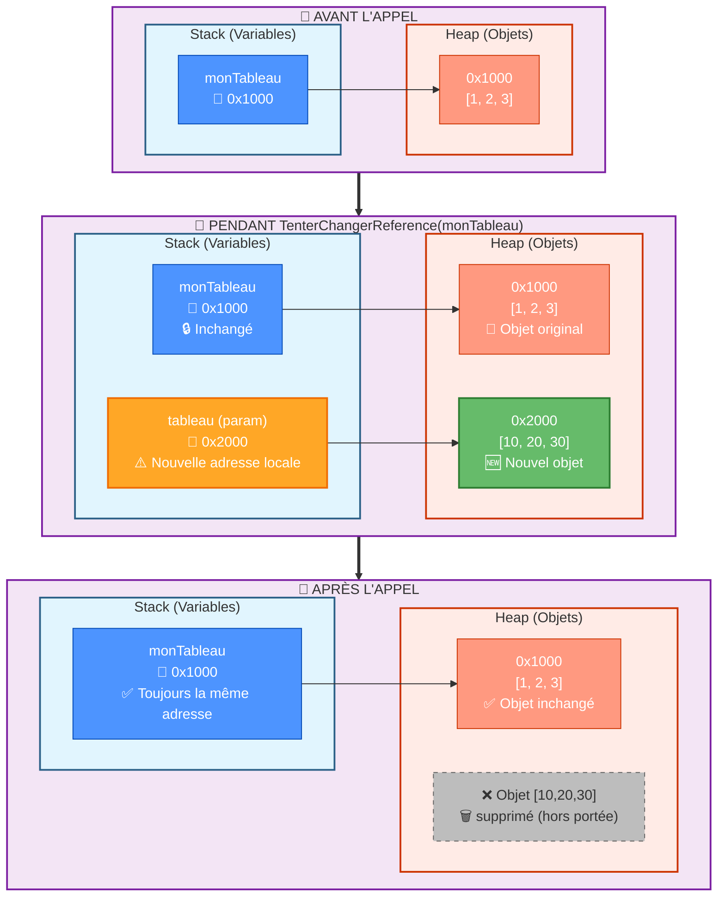
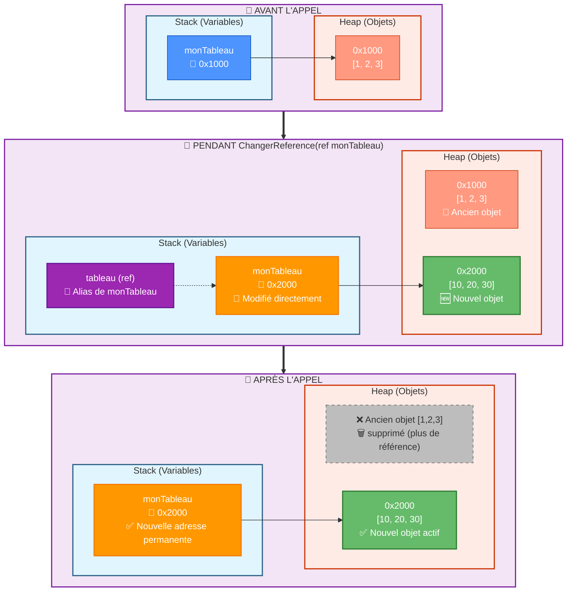
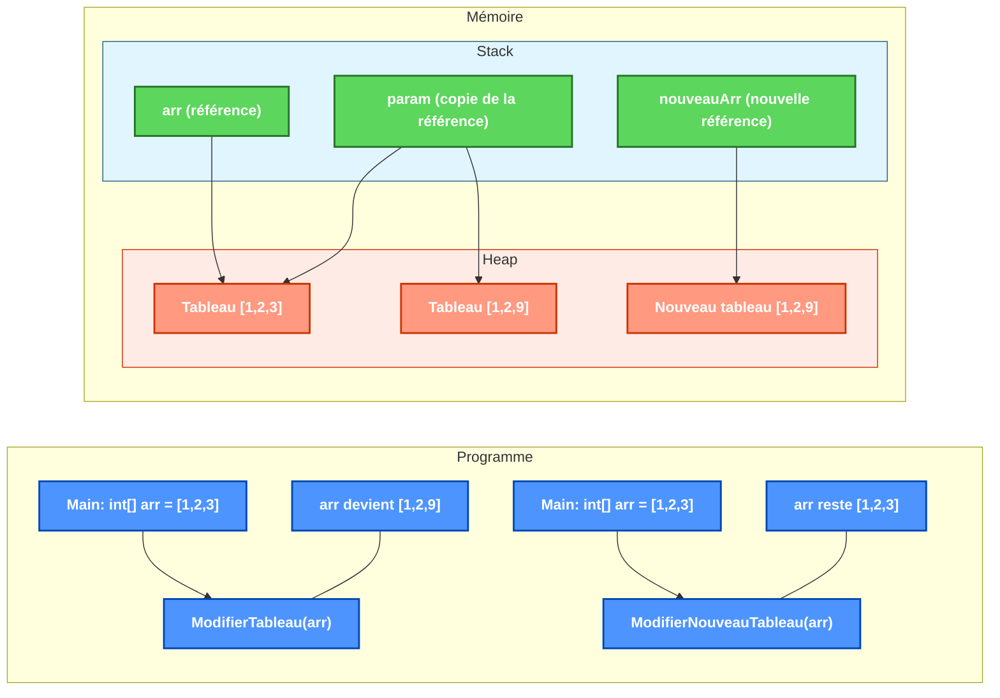

# Les fonctions

## Concept de base

Imaginez une fonction comme une petite machine à laquelle on confie une tâche précise. On lui fournit des éléments en entrée, elle exécute des étapes bien définies, puis elle nous renvoie éventuellement un résultat. C’est une manière d’organiser sa pensée et son code : on découpe un problème en gestes simples, réutilisables, et on leur donne un nom parlant.

- Une **fonction** est un bloc d'instructions qui porte un nom, qui peut prendre des **paramètres** (int, char, string, ...) en entrée et peut renvoyer une **valeur** en sortie.

Pourquoi des fonctions ?
- Clarifier le code en le découpant en morceaux cohérents et faciles à lire.
- Éviter la répétition (DRY: Don’t Repeat Yourself) et donc réduire les erreurs.
- Nommer l’intention: un bon nom raconte ce que fait le code.
- Tester plus facilement chaque pièce du programme, indépendamment des autres.

## Définition d'une fonction

### Exemple de signature simple

```csharp
void Affiche(string texte)
{
    Console.WriteLine(texte);
}
```

Pour appeler cette fonction :
```csharp
Affiche("Bonjour");
```

### Avec plusieurs paramètres

```csharp
void AfficheNFois(string texte, int nb)
{
    for (int i = 0; i < nb; i++)
    {
        Console.WriteLine(texte);
    }
}
```

Pour appeler cette fonction :
```csharp
AfficheNFois("Bonjour", 4);
```

## Fonction avec valeur de retour

Reprenons notre métaphore de la « petite machine » : parfois, on lui demande simplement d’agir (afficher un texte), parfois on lui demande de calculer et de nous rapporter un résultat. Dans ce second cas, la fonction s’engage à « rendre » une valeur à l’aide du mot-clé `return`.

Une fonction peut donc **renvoyer une valeur** avec `return` :
```csharp
int Somme(int a, int b)
{
    int resultat = a + b;
    return resultat;
}
```

Astuce de lecture: le type placé avant le nom de la fonction (`int` ici) annonce la nature de la valeur promise en retour. Si la fonction ne renvoie rien, on écrit `void`.

Pour utiliser la valeur renvoyée :
```csharp
int total = Somme(5, 3);
Console.WriteLine(total);  // Affiche 8
```

## Le passage de paramètres

Quand on appelle une fonction, on lui « apporte » des informations: ce sont les paramètres. Deux manières principales existent pour les transmettre, et elles ne racontent pas la même histoire.
- Par valeur: on donne une copie. La fonction travaille sur son exemplaire à elle.
- Par référence: on donne un lien vers l’original. La fonction peut alors modifier la chose d’origine.

Métaphore: prêter un livre
- Par valeur, c’est comme donner une photocopie: si l’autre surligne, votre livre reste intact.
- Par référence, c’est prêter votre vrai livre: s’il est annoté, votre exemplaire change.

### Par valeur

La fonction reçoit une **copie** du paramètre, les modifications sont locales seulement.

```csharp
void Increment(int nombre)
{
    nombre++;  // Modification locale uniquement
    Console.WriteLine("Dans la fonction : " + nombre);
}

int x = 5;
Increment(x);
Console.WriteLine("Après appel : " + x);  // Affiche toujours 5
```

### Par référence

La variable locale et le paramètre partagent la même instance. On utilise `ref` ou `out`.

#### Avec ref

```csharp
void Increment(ref int nombre)
{
    nombre++;  // Modifie la variable d'origine
}

int x = 5;
Increment(ref x);
Console.WriteLine(x);  // Affiche 6
```

:::: tip Erreurs fréquentes
- Oublier d’écrire `ref` à l’appel comme dans la définition: `Increment(ref x)`.
- Confondre « modifier la chose » et « changer vers une nouvelle chose »: sur un type référence, on peut modifier l’objet pointé même si on a passé « par valeur » (voir plus bas).
- Utiliser `out` sans initialiser la variable à l’appel: c’est normal, `out` promet qu’elle sera assignée dans la fonction.
::::

### Visualisation du passage de paramètres (version haute et compacte)



## Types valeur vs types référence

Pour bien comprendre ce qui se passe « sous le capot », il faut se rappeler qu'il faut distinguer deux familles de types. Cette distinction explique pourquoi, parfois, une modification semble « rester » après l’appel d’une fonction… et parfois pas.

Les comportements du passage de paramètres varient selon qu'il s'agit de types valeur (int, bool, struct...) ou de types référence (objets, tableaux, chaînes...).

### Types valeur : passage par valeur vs référence

Les **types valeur** (int, bool, char, double, struct...) stockent directement leur contenu dans la variable. Imaginez-les comme des boîtes qui contiennent réellement la valeur.

#### Passage par valeur (comportement par défaut)

Quand on passe un type valeur à une fonction, C# fait une **photocopie** de la valeur :

```csharp
void TesterPassageValeur(int nombre)
{
    Console.WriteLine($"Reçu : {nombre}");
    nombre = 100;  // On modifie la copie
    Console.WriteLine($"Modifié dans fonction : {nombre}");
}

int monNombre = 42;
Console.WriteLine($"Avant appel : {monNombre}");
TesterPassageValeur(monNombre);
Console.WriteLine($"Après appel : {monNombre}");  // Toujours 42 !
```

**Résultat :**
```
Avant appel : 42
Reçu : 42
Modifié dans fonction : 100
Après appel : 42
```

**Pourquoi ?** La fonction a reçu une copie de `monNombre`. Modifier cette copie ne change pas l'original.

#### Passage par référence (avec `ref` ou `out`)

Avec `ref`, on donne l'**adresse** de la boîte originale à la fonction :

```csharp
void TesterPassageReference(ref int nombre)
{
    Console.WriteLine($"Reçu : {nombre}");
    nombre = 100;  // On modifie l'original !
    Console.WriteLine($"Modifié dans fonction : {nombre}");
}

int monNombre = 42;
Console.WriteLine($"Avant appel : {monNombre}");
TesterPassageReference(ref monNombre);  // N'oubliez pas 'ref' !
Console.WriteLine($"Après appel : {monNombre}");  // Maintenant 100 !
```

**Résultat :**
```
Avant appel : 42
Reçu : 42
Modifié dans fonction : 100
Après appel : 100
```

**Métaphore :** C'est comme donner les clés de votre maison vs donner une photo de votre maison. Avec les clés (`ref`), la personne peut changer votre décoration !

### Types référence : passage par valeur vs référence

Les **types référence** (tableaux, objets, listes, strings...) fonctionnent différemment. La variable ne contient pas l'objet lui-même, mais une **adresse** vers l'endroit où l'objet est stocké en mémoire.

Imaginez un type référence comme un **marque-page** dans un livre :
- Le marque-page (la variable) indique une page
- Le contenu de la page (l'objet) existe quelque part dans le livre (la mémoire)



#### Passage par valeur (comportement par défaut)

Même "par valeur", on peut modifier le contenu de l'objet :

```csharp
void ModifierContenu(int[] tableau)
{
    Console.WriteLine($"Tableau reçu : [{string.Join(", ", tableau)}]");
    tableau[0] = 999;  // On modifie le contenu à travers la référence
    Console.WriteLine($"Tableau modifié : [{string.Join(", ", tableau)}]");
}

int[] monTableau = {1, 2, 3};
Console.WriteLine($"Avant appel : [{string.Join(", ", monTableau)}]");
ModifierContenu(monTableau);
Console.WriteLine($"Après appel : [{string.Join(", ", monTableau)}]");
```

**Résultat :**
```
Avant appel : [1, 2, 3]
Tableau reçu : [1, 2, 3]
Tableau modifié : [999, 2, 3]
Après appel : [999, 2, 3]
```

**Visualisation en mémoire :**



**Pourquoi ça marche ?** La fonction reçoit une copie de l'adresse, mais les deux variables pointent vers le même objet en mémoire ! Modifier l'objet via une des deux adresses affecte ce que voient les deux variables.

**Mais attention :** on ne peut pas modifier l'adresse elle-même :

```csharp
void TenterChangerReference(int[] tableau)
{
    tableau = new int[] {10, 20, 30};  // Nouvelle adresse locale uniquement
    Console.WriteLine($"Nouveau tableau dans fonction : [{string.Join(", ", tableau)}]");
}

int[] monTableau = {1, 2, 3};
Console.WriteLine($"Avant appel : [{string.Join(", ", monTableau)}]");
TenterChangerReference(monTableau);
Console.WriteLine($"Après appel : [{string.Join(", ", monTableau)}]");  // Inchangé !
```

**Résultat :**
```
Avant appel : [1, 2, 3]
Nouveau tableau dans fonction : [10, 20, 30]
Après appel : [1, 2, 3]
```

**Visualisation en mémoire :**



**Explication :** Dans la fonction, `tableau` reçoit une copie de l'adresse vers `{1, 2, 3}`. Quand on fait `tableau = new int[] {10, 20, 30}`, on change seulement la variable locale `tableau` pour qu'elle pointe vers un nouveau tableau. La variable `monTableau` dans le programme principal garde son adresse originale.

#### Passage par référence (avec `ref`)

Avec `ref`, on peut modifier la variable qui contient l'adresse :

```csharp
void ChangerReference(ref int[] tableau)
{
    tableau = new int[] {10, 20, 30};  // On change la variable originale
    Console.WriteLine($"Nouveau tableau : [{string.Join(", ", tableau)}]");
}

int[] monTableau = {1, 2, 3};
Console.WriteLine($"Avant appel : [{string.Join(", ", monTableau)}]");
ChangerReference(ref monTableau);
Console.WriteLine($"Après appel : [{string.Join(", ", monTableau)}]");
```

**Résultat :**
```
Avant appel : [1, 2, 3]
Nouveau tableau : [10, 20, 30]
Après appel : [10, 20, 30]
```

**Visualisation en mémoire :**



**Explication :** Avec `ref`, la fonction reçoit un accès direct à la variable `monTableau` elle-même. Elle peut donc changer ce vers quoi pointe cette variable. Le paramètre `tableau` n'est pas une copie, mais un **alias** de `monTableau`.

**Résumé des comportements :**
- **Types valeur par valeur** : copie de la valeur → modifications locales seulement
- **Types valeur par référence** : accès direct à la variable → modifications permanentes
- **Types référence par valeur** : copie de l'adresse → peut modifier l'objet, pas la variable
- **Types référence par référence** : accès direct à la variable ET à l'objet → contrôle total


### Exemple concret avec tableau

Voici comment les tableaux (types référence) se comportent avec différentes approches :

```csharp
// Modification du tableau original
void ModifierTableau(int[] param)
{
    param[2] = 9;  // Modifie le tableau original
}

// Création d'un nouveau tableau
void ModifierNouveauTableau(int[] param)
{
    int[] nouveauArr = new int[] {param[0], param[1], 9};
    // nouveauArr pointe vers un nouveau tableau
    // param n'est pas modifié
}

// Dans le programme principal
int[] arr = new int[] {1, 2, 3};
ModifierTableau(arr);
Console.WriteLine(arr[2]);  // Affiche 9 (modifié)

arr = new int[] {1, 2, 3};
ModifierNouveauTableau(arr);
Console.WriteLine(arr[2]);  // Affiche 3 (non modifié)
```



::: tip Points importants à retenir
1. **Types valeur** (int, bool, char, struct...) :
   - Passés par valeur : la fonction reçoit une copie, les modifications sont locales
   - Passés par référence (ref/out) : la fonction modifie la variable originale

2. **Types référence** (tableaux, objets, listes...) :
   - Passés par valeur : la fonction reçoit une copie de la référence, mais peut modifier l'objet original
   - Passés par référence (ref/out) : la fonction peut changer la référence elle-même
:::

### Quand utiliser le passage par référence ?

- Pour modifier plusieurs valeurs dans une fonction
- Pour éviter la copie de grandes structures de données
- Pour retourner plusieurs valeurs depuis une fonction

```csharp
void CalculerStatistiques(int[] donnees, out double moyenne, out double ecartType)
{
    moyenne = donnees.Average();
    
    double sommeCarres = 0;
    foreach (int valeur in donnees)
    {
        sommeCarres += Math.Pow(valeur - moyenne, 2);
    }
    
    ecartType = Math.Sqrt(sommeCarres / donnees.Length);
}

// Utilisation:
int[] mesures = new int[] {5, 7, 9, 12, 15};
double moy, ecart;
CalculerStatistiques(mesures, out moy, out ecart);
Console.WriteLine($"Moyenne: {moy}, Écart-type: {ecart}");
```

#### Avec out

```csharp
void ObtenirDonnees(out int valeur)
{
    valeur = 42;  // Doit assigner une valeur
}

int resultat;
ObtenirDonnees(out resultat);
Console.WriteLine(resultat);  // Affiche 42
```

::: warning Différence entre ref et out
- `ref` : la variable doit être initialisée avant l'appel
- `out` : la variable peut ne pas être initialisée, mais doit recevoir une valeur dans la fonction
:::

## Paramètres optionnels

```csharp
void Message(string texte, bool majuscules = false)
{
    if (majuscules)
    {
        Console.WriteLine(texte.ToUpper());
    }
    else
    {
        Console.WriteLine(texte);
    }
}
```

Utilisation :
```csharp
Message("Hello");  // Paramètre optionnel non fourni
Message("Hello", true);  // Paramètre optionnel fourni
```

## Surcharge de fonction

La **surcharge** permet de définir plusieurs fonctions avec le même nom mais des paramètres différents.

```csharp
int Addition(int a, int b)
{
    return a + b;
}

double Addition(double a, double b)
{
    return a + b;
}
```

Le compilateur choisit automatiquement la bonne fonction selon les types des arguments.

## Fonctions récursives

Une fonction **récursive** s'appelle elle-même.

```csharp
int Factorielle(int n)
{
    if (n <= 1)
        return 1;
    else
        return n * Factorielle(n - 1);
}
```

::: danger Attention
Les fonctions récursives doivent toujours avoir une condition de sortie pour éviter un débordement de pile.
:::

## Fonctions anonymes et expressions lambda

Les fonctions anonymes et expressions lambda permettent de définir des fonctions sans nom.

```csharp
// Fonction anonyme
Func<int, int, int> addition = delegate(int a, int b) { return a + b; };

// Expression lambda équivalente
Func<int, int, int> addition = (a, b) => a + b;

Console.WriteLine(addition(5, 3));  // Affiche 8
```

## En résumé

- Une fonction est une pièce de code qui porte un nom, peut recevoir des paramètres et, parfois, rend une valeur avec `return`.
- Passer « par valeur », c’est donner une copie; passer « par référence », c’est prêter l’original.
- Les types valeur (int, bool, struct) se comportent différemment des types référence (tableaux, objets): gardez cette différence à l’esprit.
- `ref` et `out` permettent à une fonction d’influencer des variables définies à l’extérieur: `ref` nécessite une variable initialisée; `out` promet de l’initialiser.

Petite checklist avant d’écrire une fonction
- Ai-je un nom clair qui dit ce que la fonction fait ?
- Quels paramètres sont vraiment nécessaires et de quel type ?
- La fonction doit-elle renvoyer une valeur ? Laquelle ?
- Y a-t-il des effets de bord attendus (modifications d’objets) ? Sont-ils souhaitables et documentés ?
