# Les fonctions

## Concept de base

Imaginez une fonction comme une petite machine à laquelle on confie une tâche précise. On lui fournit des éléments en entrée, elle exécute des étapes bien définies, puis elle nous renvoie éventuellement un résultat. C'est une manière d'organiser sa pensée et son code : on découpe un problème en gestes simples, réutilisables, et on leur donne un nom parlant.

Une **fonction** est un bloc d'instructions qui porte un nom, qui peut prendre des **paramètres** en entrée et peut renvoyer une **valeur** en sortie.

**Pourquoi utiliser des fonctions ?**
- **Clarifier le code** en le découpant en morceaux cohérents et faciles à lire
- **Éviter la répétition** (DRY: Don't Repeat Yourself) et donc réduire les erreurs
- **Nommer l'intention** : un bon nom raconte ce que fait le code
- **Tester plus facilement** chaque pièce du programme, indépendamment des autres

## Définition d'une fonction

### Exemple de signature simple

```csharp
void Affiche(string texte)
{
    Console.WriteLine(texte);
}
```

Pour appeler cette fonction :
```csharp
Affiche("Bonjour");
```

### Avec plusieurs paramètres

```csharp
void AfficheNFois(string texte, int nb)
{
    for (int i = 0; i < nb; i++)
    {
        Console.WriteLine(texte);
    }
}
```

Pour appeler cette fonction :
```csharp
AfficheNFois("Bonjour", 4);
```

## Signature de fonction

La **signature d'une fonction** est sa carte d'identité : elle décrit précisément comment identifier et utiliser cette fonction. Elle comprend :

1. **Le nom de la fonction**
2. **Le nombre de paramètres**
3. **Le type de chaque paramètre**
4. **L'ordre des paramètres**

::: tip Important
Le **type de retour ne fait PAS partie de la signature** en C#. Deux fonctions ne peuvent pas avoir la même signature même si elles retournent des types différents.
:::

### Exemples de signatures

```csharp
// Signature : Affiche(string)
void Affiche(string texte)

// Signature : Addition(int, int)
int Addition(int a, int b)

// Signature : CalculerMoyenne(double, double, double)
double CalculerMoyenne(double note1, double note2, double note3)

// Signature : ConvertirEnMajuscules(string)
string ConvertirEnMajuscules(string texte)
```

### Signatures distinctes vs identiques

Ces fonctions ont des **signatures différentes** (surcharge valide) :
```csharp
void Afficher(int nombre)           // Signature : Afficher(int)
void Afficher(string texte)         // Signature : Afficher(string)  
void Afficher(int a, int b)         // Signature : Afficher(int, int)
void Afficher(string nom, int age)  // Signature : Afficher(string, int)
```

Ces fonctions ont la **même signature** (erreur de compilation) :
```csharp
void Calculer(int a, int b)         // Signature : Calculer(int, int)
int Calculer(int x, int y)          // ❌ ERREUR ! Même signature
double Calculer(int nb1, int nb2)   // ❌ ERREUR ! Même signature
```

Le compilateur ne peut pas distinguer ces fonctions car elles ont la même signature, même si :
- Les noms des paramètres sont différents (`a,b` vs `x,y` vs `nb1,nb2`)
- Les types de retour sont différents (`void` vs `int` vs `double`)

### Pourquoi la signature est-elle importante ?

1. **Identification unique** : la signature permet au compilateur de savoir quelle fonction appeler
2. **Surcharge de fonctions** : on peut avoir plusieurs fonctions avec le même nom si leurs signatures sont différentes
3. **Résolution d'appel** : le compilateur choisit automatiquement la bonne fonction selon les arguments fournis

```csharp
// Le compilateur choisit automatiquement selon les arguments
Afficher(42);           // Appelle Afficher(int)
Afficher("Hello");      // Appelle Afficher(string)
Afficher(1, 2);         // Appelle Afficher(int, int)
Afficher("Alice", 25);  // Appelle Afficher(string, int)
```

## Fonction avec valeur de retour

Une fonction peut **renvoyer une valeur** avec le mot-clé `return`. Reprenons notre métaphore de la « petite machine » : parfois, on lui demande simplement d'agir (afficher un texte), parfois on lui demande de calculer et de nous rapporter un résultat.

```csharp
int Somme(int a, int b)
{
    int resultat = a + b;
    return resultat;
}
```

💡 **Astuce de lecture** : le type placé avant le nom de la fonction (`int` ici) annonce la nature de la valeur promise en retour. Si la fonction ne renvoie rien, on écrit `void`.

Pour utiliser la valeur renvoyée :
```csharp
int total = Somme(5, 3);
Console.WriteLine(total);  // Affiche 8
```

## Le passage de paramètres

Quand on appelle une fonction, on lui « apporte » des informations: ce sont les paramètres. Deux manières principales existent pour les transmettre, et elles ne racontent pas la même histoire.

### Comportement par défaut : passage par valeur

En C#, **le passage par valeur est le comportement par défaut**. Cela signifie que :
- Par valeur: on donne une copie. La fonction travaille sur son exemplaire à elle.
- Par référence: on donne un lien vers l'original. La fonction peut alors modifier la chose d'origine.

Pour forcer un passage par référence, il faut explicitement utiliser les mots-clés `ref` ou `out`.

Métaphore: prêter un livre
- Par valeur (défaut), c'est comme donner une photocopie: si l'autre surligne, votre livre reste intact.
- Par référence (avec `ref` ou `out`), c'est prêter votre vrai livre: s'il est annoté, votre exemplaire change.

### Par valeur

La fonction reçoit une **copie** du paramètre, les modifications sont locales seulement.

```csharp
void Increment(int nombre)
{
    nombre++;  // Modification locale uniquement
    Console.WriteLine("Dans la fonction : " + nombre);
}

int x = 5;
Increment(x);
Console.WriteLine("Après appel : " + x);  // Affiche toujours 5
```

### Par référence

La variable locale et le paramètre partagent la même instance. On utilise `ref` ou `out`.

#### Différence entre ref et out

**`ref` (référence)** :
- La variable **doit être initialisée** avant l'appel de la fonction
- La fonction peut lire ET modifier la valeur
- Utilisé quand on veut modifier une variable existante

**`out` (sortie)** :
- La variable **peut ne pas être initialisée** avant l'appel
- La fonction **doit obligatoirement** assigner une valeur au paramètre
- Utilisé quand la fonction doit "retourner" plusieurs valeurs

#### Avec ref

```csharp
void Increment(ref int nombre)
{
    nombre++;  // Modifie la variable d'origine
}

int x = 5;
Increment(ref x);
Console.WriteLine(x);  // Affiche 6
```

:::: tip Erreurs fréquentes
- Oublier d’écrire `ref` à l’appel comme dans la définition: `Increment(ref x)`.
- Confondre « modifier la chose » et « changer vers une nouvelle chose »: sur un type référence, on peut modifier l’objet pointé même si on a passé « par valeur » (voir plus bas).
- Utiliser `out` sans initialiser la variable à l’appel: c’est normal, `out` promet qu’elle sera assignée dans la fonction.
::::

### Visualisation du passage de paramètres (version haute et compacte)

```mermaid
%%{init: {'flowchart': {'useMaxWidth': false, 'rankSpacing': 90, 'nodeSpacing': 20}}}%%
flowchart LR
    subgraph Passage_par_valeur
        direction TB
        A1[Appelant: x = 5]
        A2[Copie → paramètre]
        A3[Fonction: nombre = 5]
        A4[Fonction: nombre++ → 6]
        A5[Appelant: x reste 5]
        A1 --> A2 --> A3 --> A4 -.-> A5
    end

    subgraph Passage_par_reference
        direction TB
        B1[Appelant: x = 5]
        B2[Référence → paramètre]
        B3[Fonction: nombre = 5]
        B4[Fonction: nombre++ → 6]
        B5[Appelant: x devient 6]
        B1 --> B2 --> B3 --> B4 --> B5
    end

    Passage_par_valeur --- Passage_par_reference


    class A1,A5,B1,B5 valeur
    class A3,A4,B3,B4 fonction

    classDef valeur fill:#4d94ff,stroke:#0047b3,stroke-width:2px,color:#fff,font-weight:bold
    classDef fonction fill:#ff9980,stroke:#cc3300,stroke-width:2px,color:#fff,font-weight:bold
```



### Reconnaître le passage par valeur/référence d'un type valeur/référence

| Types \ Passage de paramètre | Passage par valeur | Passage par référence |
|------------------------------|--------------------|-----------------------|
| Type valeur                  | `f(int i)`         | `f(ref int i)`        |
| Type référence               | `f(List<int> l)`   | `f(ref List<int> l)`  |


## Types valeur vs types référence

Pour bien comprendre ce qui se passe « sous le capot », il faut se rappeler qu'il faut distinguer deux familles de types. Cette distinction explique pourquoi, parfois, une modification semble « rester » après l’appel d’une fonction… et parfois pas.

Les comportements du passage de paramètres varient selon qu'il s'agit de types valeur (int, bool, struct...) ou de types référence (objets, tableaux, chaînes...).


### Types valeur : passage par valeur vs référence

Les **types valeur** (int, bool, char, double, struct...) stockent directement leur contenu dans la variable. Imaginez-les comme des boîtes qui contiennent réellement la valeur.

#### Passage par valeur (comportement par défaut)

Quand on passe un type valeur à une fonction, C# fait une **photocopie** de la valeur :

```csharp
void TesterPassageValeur(int nombre)
{
    Console.WriteLine($"Reçu : {nombre}");
    nombre = 100;  // On modifie la copie
    Console.WriteLine($"Modifié dans fonction : {nombre}");
}

int monNombre = 42;
Console.WriteLine($"Avant appel : {monNombre}");
TesterPassageValeur(monNombre);
Console.WriteLine($"Après appel : {monNombre}");  // Toujours 42 !
```

**Résultat :**
```
Avant appel : 42
Reçu : 42
Modifié dans fonction : 100
Après appel : 42
```

**Pourquoi ?** La fonction a reçu une copie de `monNombre`. Modifier cette copie ne change pas l'original.

#### Passage par référence (avec `ref` ou `out`)

Avec `ref`, on donne l'**adresse** de la boîte originale à la fonction :

```csharp
void TesterPassageReference(ref int nombre)
{
    Console.WriteLine($"Reçu : {nombre}");
    nombre = 100;  // On modifie l'original !
    Console.WriteLine($"Modifié dans fonction : {nombre}");
}

int monNombre = 42;
Console.WriteLine($"Avant appel : {monNombre}");
TesterPassageReference(ref monNombre);  // N'oubliez pas 'ref' !
Console.WriteLine($"Après appel : {monNombre}");  // Maintenant 100 !
```

**Résultat :**
```
Avant appel : 42
Reçu : 42
Modifié dans fonction : 100
Après appel : 100
```

**Métaphore :** C'est comme donner les clés de votre maison vs donner une photo de votre maison. Avec les clés (`ref`), la personne peut changer votre décoration !

### Types référence : passage par valeur vs référence

Les **types référence** (tableaux, objets, listes, strings...) fonctionnent différemment. La variable ne contient pas l'objet lui-même, mais une **adresse** vers l'endroit où l'objet est stocké en mémoire.

Imaginez un type référence comme un **marque-page** dans un livre :
- Le marque-page (la variable) indique une page
- Le contenu de la page (l'objet) existe quelque part dans le livre (la mémoire)


#### Passage par valeur (comportement par défaut)

Même "par valeur", on peut modifier le contenu de l'objet :

```csharp
void ModifierContenu(int[] tableau)
{
    Console.WriteLine($"Tableau reçu : [{string.Join(", ", tableau)}]");
    tableau[0] = 999;  // On modifie le contenu à travers la référence
    Console.WriteLine($"Tableau modifié : [{string.Join(", ", tableau)}]");
}

int[] monTableau = {1, 2, 3};
Console.WriteLine($"Avant appel : [{string.Join(", ", monTableau)}]");
ModifierContenu(monTableau);
Console.WriteLine($"Après appel : [{string.Join(", ", monTableau)}]");
```

**Résultat :**
```
Avant appel : [1, 2, 3]
Tableau reçu : [1, 2, 3]
Tableau modifié : [999, 2, 3]
Après appel : [999, 2, 3]
```

**Visualisation en mémoire :**



```mermaid
%%{init: {'theme': 'base', 'themeVariables': { 'fontSize': '16px', 'fontFamily': 'Arial', 'primaryColor': '#ffffff', 'primaryTextColor': '#000000', 'primaryBorderColor': '#000000', 'lineColor': '#000000', 'nodeSpacing': 50, 'rankSpacing': 80, 'subgraphTextSize': '14px' }, 'flowchart': { 'useMaxWidth': true, 'htmlLabels': true, 'curve': 'linear', 'subgraphTitleMargin': {'top': 5, 'bottom': 5}, 'width': 1000 }}}%%
flowchart TB
    subgraph Avant["🔸 AVANT L'APPEL"]
        direction LR
        subgraph Stack1["Stack (Variables)"]
            V1["monTableau<br/>📍 0x1000"]
        end
        subgraph Heap1["Heap (Objets)"]
            O1["0x1000<br/>[1, 2, 3]"]
        end
        V1 --> O1
    end
    
    subgraph Pendant["🔸 PENDANT L'APPEL"]
        direction LR
        subgraph Stack2["Stack (Variables)"]
            V2["monTableau<br/>📍 0x1000"]
            V3["tableau (param)<br/>📍 0x1000<br/>📋 copie de l'adresse"]
        end
        subgraph Heap2["Heap (Objets)"]
            O2["0x1000<br/>[999, 2, 3]<br/>⚠️ Modifié !"]
        end
        V2 --> O2
        V3 --> O2
    end
    
    subgraph Apres["🔸 APRÈS L'APPEL"]
        direction LR
        subgraph Stack3["Stack (Variables)"]
            V4["monTableau<br/>📍 0x1000"]
        end
        subgraph Heap3["Heap (Objets)"]
            O3["0x1000<br/>[999, 2, 3]<br/>✅ Changement permanent"]
        end
        V4 --> O3
    end
    
    Avant ==> Pendant
    Pendant ==> Apres
    
    classDef stack fill:#e1f5fe,stroke:#2B6087,stroke-width:2px,font-size:14px,color:#000
    classDef heap fill:#ffebe6,stroke:#CC3300,stroke-width:2px,font-size:14px,color:#000
    classDef var fill:#4d94ff,stroke:#0047b3,stroke-width:1px,color:#fff,font-size:13px,padding:8px
    classDef obj fill:#ff9980,stroke:#cc3300,stroke-width:1px,color:#fff,font-size:13px,padding:8px
    classDef modified fill:#ff6b6b,stroke:#d63031,stroke-width:2px,color:#fff,font-size:13px,padding:8px
    classDef phase fill:#f3e5f5,stroke:#7b1fa2,stroke-width:2px,font-size:16px,color:#000
    
    class Stack1,Stack2,Stack3 stack
    class Heap1,Heap2,Heap3 heap
    class V1,V2,V3,V4 var
    class O1,O3 obj
    class O2 modified
    class Avant,Pendant,Apres phase
```

**Pourquoi ça marche ?** La fonction reçoit une copie de l'adresse, mais les deux variables pointent vers le même objet en mémoire ! Modifier l'objet via une des deux adresses affecte ce que voient les deux variables.

**Mais attention :** on ne peut pas modifier l'adresse elle-même :

```csharp
void TenterChangerReference(int[] tableau)
{
    tableau = new int[] {10, 20, 30};  // Nouvelle adresse locale uniquement
    Console.WriteLine($"Nouveau tableau dans fonction : [{string.Join(", ", tableau)}]");
}

int[] monTableau = {1, 2, 3};
Console.WriteLine($"Avant appel : [{string.Join(", ", monTableau)}]");
TenterChangerReference(monTableau);
Console.WriteLine($"Après appel : [{string.Join(", ", monTableau)}]");  // Inchangé !
```

**Résultat :**
```
Avant appel : [1, 2, 3]
Nouveau tableau dans fonction : [10, 20, 30]
Après appel : [1, 2, 3]
```

**Visualisation en mémoire :**


**Explication :** Dans la fonction, `tableau` reçoit une copie de l'adresse vers `{1, 2, 3}`. Quand on fait `tableau = new int[] {10, 20, 30}`, on change seulement la variable locale `tableau` pour qu'elle pointe vers un nouveau tableau. La variable `monTableau` dans le programme principal garde son adresse originale.

#### Passage par référence (avec `ref`)

Avec `ref`, on peut modifier la variable qui contient l'adresse :

```csharp
void ChangerReference(ref int[] tableau)
{
    tableau = new int[] {10, 20, 30};  // On change la variable originale
    Console.WriteLine($"Nouveau tableau : [{string.Join(", ", tableau)}]");
}

int[] monTableau = {1, 2, 3};
Console.WriteLine($"Avant appel : [{string.Join(", ", monTableau)}]");
ChangerReference(ref monTableau);
Console.WriteLine($"Après appel : [{string.Join(", ", monTableau)}]");
```

**Résultat :**
```
Avant appel : [1, 2, 3]
Nouveau tableau : [10, 20, 30]
Après appel : [10, 20, 30]
```

**Visualisation en mémoire :**



```mermaid
%%{init: {'theme': 'base', 'themeVariables': { 'fontSize': '16px', 'fontFamily': 'Arial', 'primaryColor': '#ffffff', 'primaryTextColor': '#000000', 'primaryBorderColor': '#000000', 'lineColor': '#000000', 'nodeSpacing': 50, 'rankSpacing': 80, 'subgraphTextSize': '18px' }, 'flowchart': { 'useMaxWidth': true, 'htmlLabels': true, 'curve': 'linear' }}}%%
flowchart TB
    subgraph Avant["🔸 AVANT L'APPEL"]
        direction LR
        subgraph Stack1["Stack (Variables)"]
            V1["monTableau<br/>📍 0x1000"]
        end
        subgraph Heap1["Heap (Objets)"]
            O1["0x1000<br/>[1, 2, 3]"]
        end
        V1 --> O1
    end
    
    subgraph Pendant["🔸 PENDANT L'APPEL"]
        direction LR
        subgraph Stack2["Stack (Variables)"]
            V2["monTableau<br/>📍 0x2000<br/>🔄 Modifié directement"]
            V3["tableau (ref)<br/>🔗 Alias de monTableau"]
        end
        subgraph Heap2["Heap (Objets)"]
            O2["0x1000<br/>[1, 2, 3]<br/>📍 Ancien objet"]
            O3["0x2000<br/>[10, 20, 30]<br/>🆕 Nouvel objet"]
        end
        V2 --> O3
        V3 -.-> V2
    end
    
    subgraph Apres["🔸 APRÈS L'APPEL"]
        direction LR
        subgraph Stack3["Stack (Variables)"]
            V4["monTableau<br/>📍 0x2000<br/>✅ Nouvelle adresse permanente"]
        end
        subgraph Heap3["Heap (Objets)"]
            O4["❌ Ancien objet [1,2,3]<br/>🗑️ supprimé (plus de référence)"]
            O5["0x2000<br/>[10, 20, 30]<br/>✅ Nouvel objet actif"]
        end
        V4 --> O5
    end
    
    Avant ==> Pendant
    Pendant ==> Apres
    
    classDef stack fill:#e1f5fe,stroke:#2B6087,stroke-width:2px,font-size:14px,color:#000,white-space:nowrap
    classDef heap fill:#ffebe6,stroke:#CC3300,stroke-width:2px,font-size:14px,color:#000,white-space:nowrap
    classDef var fill:#4d94ff,stroke:#0047b3,stroke-width:1px,color:#fff,font-size:13px,padding:8px,white-space:nowrap
    classDef varRef fill:#9c27b0,stroke:#6a1b9a,stroke-width:2px,color:#fff,font-size:13px,padding:8px,white-space:nowrap
    classDef varChanged fill:#ff9800,stroke:#f57c00,stroke-width:2px,color:#fff,font-size:13px,padding:8px,white-space:nowrap
    classDef obj fill:#ff9980,stroke:#cc3300,stroke-width:1px,color:#fff,font-size:13px,padding:8px,white-space:nowrap
    classDef objNew fill:#66bb6a,stroke:#2e7d32,stroke-width:2px,color:#fff,font-size:13px,padding:8px,white-space:nowrap
    classDef objDeleted fill:#bdbdbd,stroke:#616161,stroke-width:1px,color:#333,stroke-dasharray: 5 5,font-size:13px,padding:8px,white-space:nowrap
    classDef phase fill:#f3e5f5,stroke:#7b1fa2,stroke-width:2px,font-size:16px,color:#000,white-space:nowrap
    
    class Stack1,Stack2,Stack3 stack
    class Heap1,Heap2,Heap3 heap
    class V1 var
    class V2,V4 varChanged
    class V3 varRef
    class O1,O2 obj
    class O3,O5 objNew
    class O4 objDeleted
    class Avant,Pendant,Apres phase
```

**Explication :** Avec `ref`, la fonction reçoit un accès direct à la variable `monTableau` elle-même. Elle peut donc changer ce vers quoi pointe cette variable. Le paramètre `tableau` n'est pas une copie, mais un **alias** de `monTableau`.

**Résumé des comportements :**
- **Types valeur par valeur** : copie de la valeur → modifications locales seulement
- **Types valeur par référence** : accès direct à la variable → modifications permanentes
- **Types référence par valeur** : copie de l'adresse → peut modifier l'objet, pas la variable
- **Types référence par référence** : accès direct à la variable ET à l'objet → contrôle total


### Exemple concret avec tableau

Voici comment les tableaux (types référence) se comportent avec différentes approches :

```csharp
// Modification du tableau original
void ModifierTableau(int[] param)
{
    param[2] = 9;  // Modifie le tableau original
}

// Création d'un nouveau tableau
void ModifierNouveauTableau(int[] param)
{
    int[] nouveauArr = new int[] {param[0], param[1], 9};
    // nouveauArr pointe vers un nouveau tableau
    // param n'est pas modifié
}

// Dans le programme principal
int[] arr = new int[] {1, 2, 3};
ModifierTableau(arr);
Console.WriteLine(arr[2]);  // Affiche 9 (modifié)

arr = new int[] {1, 2, 3};
ModifierNouveauTableau(arr);
Console.WriteLine(arr[2]);  // Affiche 3 (non modifié)
```



```mermaid
flowchart LR
    %% Ce qui se passe dans le programme
    subgraph prog["Programme"]
        direction TB
        P1["Main: int[] arr = [1,2,3]"] --> P2["ModifierTableau(arr)"]
        P3["arr devient [1,2,9]"] --- P2

        P4["Main: int[] arr = [1,2,3]"] --> P5["ModifierNouveauTableau(arr)"]
        P6["arr reste [1,2,3]"] --- P5
    end

    %% Explication mémoire
    subgraph "Mémoire"
        direction TB
        subgraph "Stack"
            S1["arr (référence)"]
            S2["param (copie de la référence)"]
            S3["nouveauArr (nouvelle référence)"]
        end

        subgraph "Heap"
            H1["Tableau [1,2,3]"]
            H2["Tableau [1,2,9]"]
            H3["Nouveau tableau [1,2,9]"]
        end

        %% Connexions
        S1 --> H1
        S2 --> H1
        S2 --> H2
        S3 --> H3
    end



    %% Styles
    classDef program fill:#f9f9f9,stroke:#333,stroke-width:1px
    classDef stack fill:#e1f5fe,stroke:#2B6087,stroke-width:1px
    classDef heap fill:#ffebe6,stroke:#CC3300,stroke-width:1px
    classDef code fill:#4d94ff,stroke:#0047b3,stroke-width:2px,color:#fff,font-weight:bold
    classDef memory fill:#5cd65c,stroke:#267326,stroke-width:2px,color:#fff,font-weight:bold
    classDef heapObj fill:#ff9980,stroke:#cc3300,stroke-width:2px,color:#fff,font-weight:bold

    class Programme program
    class Stack stack
    class Heap heap
    class P1,P2,P3,P4,P5,P6 code
    class S1,S2,S3 memory
    class H1,H2,H3 heapObj
```

::: tip Points importants à retenir
1. **Types valeur** (int, bool, char, struct...) :
   - Passés par valeur : la fonction reçoit une copie, les modifications sont locales
   - Passés par référence (ref/out) : la fonction modifie la variable originale

2. **Types référence** (tableaux, objets, listes...) :
   - Passés par valeur : la fonction reçoit une copie de la référence, mais peut modifier l'objet original
   - Passés par référence (ref/out) : la fonction peut changer la référence elle-même
:::

### Quand utiliser le passage par référence ?

- Pour modifier plusieurs valeurs dans une fonction
- Pour éviter la copie de grandes structures de données
- Pour retourner plusieurs valeurs depuis une fonction

```csharp
void CalculerStatistiques(int[] donnees, out double moyenne, out double ecartType)
{
    moyenne = donnees.Average();
    
    double sommeCarres = 0;
    foreach (int valeur in donnees)
    {
        sommeCarres += Math.Pow(valeur - moyenne, 2);
    }
    
    ecartType = Math.Sqrt(sommeCarres / donnees.Length);
}

// Utilisation:
int[] mesures = new int[] {5, 7, 9, 12, 15};
double moy, ecart;
CalculerStatistiques(mesures, out moy, out ecart);
Console.WriteLine($"Moyenne: {moy}, Écart-type: {ecart}");
```

#### Avec out

```csharp
void ObtenirDonnees(out int valeur)
{
    valeur = 42;  // Doit obligatoirement assigner une valeur
}

int resultat;  // Pas besoin d'initialiser avec out
ObtenirDonnees(out resultat);
Console.WriteLine(resultat);  // Affiche 42
```

#### Exemple comparatif ref vs out

```csharp
// Avec ref : variable doit être initialisée
void DoublerAvecRef(ref int nombre)
{
    Console.WriteLine($"Valeur reçue : {nombre}");  // Peut lire la valeur
    nombre = nombre * 2;  // Modifie la valeur
}

// Avec out : variable sera initialisée dans la fonction
void CreerNombreAvecOut(out int nombre)
{
    // Console.WriteLine(nombre);  // ERREUR! Ne peut pas lire avant d'assigner
    nombre = 100;  // Doit obligatoirement assigner
}

// Utilisation
int x = 5;  // Doit être initialisé pour ref
DoublerAvecRef(ref x);
Console.WriteLine(x);  // Affiche 10

int y;  // Pas besoin d'initialiser pour out
CreerNombreAvecOut(out y);
Console.WriteLine(y);  // Affiche 100
```

::: warning Différence entre ref et out
- `ref` : la variable **doit être initialisée** avant l'appel et peut être lue dans la fonction
- `out` : la variable **peut ne pas être initialisée** avant l'appel, mais **doit obligatoirement** recevoir une valeur dans la fonction
:::

## Paramètres optionnels

```csharp
void Message(string texte, bool majuscules = false)
{
    if (majuscules)
    {
        Console.WriteLine(texte.ToUpper());
    }
    else
    {
        Console.WriteLine(texte);
    }
}
```

Utilisation :
```csharp
Message("Hello");  // Paramètre optionnel non fourni
Message("Hello", true);  // Paramètre optionnel fourni
```

## Paramètres nommés

Les **paramètres nommés** permettent de spécifier explicitement le nom du paramètre lors de l'appel d'une fonction. Cela améliore la lisibilité du code et permet de passer les paramètres dans n'importe quel ordre.

### Syntaxe

```csharp
void CreerPersonne(string nom, string prenom, int age, string ville = "Inconnue")
{
    Console.WriteLine($"{prenom} {nom}, {age} ans, habite à {ville}");
}
```

### Appel avec paramètres nommés

```csharp
// Appel classique (ordre des paramètres important)
CreerPersonne("Dupont", "Jean", 25, "Bruxelles");

// Appel avec paramètres nommés (ordre libre)
CreerPersonne(age: 25, nom: "Dupont", prenom: "Jean", ville: "Bruxelles");

// Mélange paramètres positionnels et nommés
CreerPersonne("Dupont", "Jean", age: 25, ville: "Bruxelles");

// Avec paramètre optionnel omis
CreerPersonne(nom: "Martin", prenom: "Marie", age: 30);
```

### Avantages des paramètres nommés

1. **Clarté du code** : le nom du paramètre indique explicitement ce que représente la valeur
   ```csharp
   // Peu clair
   CalculerPrix(100, 0.21, true, false);
   
   // Beaucoup plus clair
   CalculerPrix(montant: 100, tva: 0.21, inclureTva: true, appliquerRemise: false);
   ```

2. **Ordre flexible** : possibilité de passer les paramètres dans n'importe quel ordre
   ```csharp
   void ConfigurerServeur(string host, int port, bool ssl, string database)
   {
       // Configuration du serveur
   }
   
   // Ordre des paramètres libre avec noms
   ConfigurerServeur(ssl: true, database: "mydb", host: "localhost", port: 8080);
   ```

3. **Sécurité** : évite les erreurs dues à l'inversion de paramètres de même type
   ```csharp
   void DeplacerPoint(int x, int y)
   {
       Console.WriteLine($"Déplacement vers ({x}, {y})");
   }
   
   // Risque d'erreur
   DeplacerPoint(5, 10);  // x=5, y=10 ou x=10, y=5 ?
   
   // Pas d'ambiguïté
   DeplacerPoint(x: 5, y: 10);  // Clairement x=5, y=10
   ```

### Règles importantes

- Les paramètres positionnels doivent venir **avant** les paramètres nommés
- Une fois qu'un paramètre nommé est utilisé, tous les suivants doivent aussi être nommés

```csharp
// ✅ Correct
MaFonction(param1, param2, nom3: valeur3, nom4: valeur4);

// ❌ Incorrect - paramètre positionnel après un paramètre nommé
MaFonction(param1, nom2: valeur2, param3, nom4: valeur4);
```

## Surcharge de fonction

La **surcharge** permet de définir plusieurs fonctions avec le même nom mais des paramètres différents.

```csharp
int Addition(int a, int b)
{
    return a + b;
}

double Addition(double a, double b)
{
    return a + b;
}
```

Le compilateur choisit automatiquement la bonne fonction selon les types des arguments.

## Fonctions récursives

Une fonction **récursive** est une fonction qui s'appelle elle-même pour résoudre un problème. C'est comme une poupée russe : pour ouvrir une grande poupée, on ouvre une plus petite à l'intérieur, puis une encore plus petite, jusqu'à arriver à la plus petite qui ne contient plus rien.

### Principe fondamental

Toute fonction récursive doit respecter deux règles absolues :

1. **Cas de base** (condition d'arrêt) : une situation où la fonction ne s'appelle plus elle-même
2. **Réduction du problème** : à chaque appel, le problème doit devenir plus simple et se rapprocher du cas de base

### Exemple simple : compte à rebours

Commençons par un exemple très simple pour comprendre le mécanisme :

```csharp
void CompteARebours(int n)
{
    // Cas de base : on s'arrête à 0
    if (n <= 0)
    {
        Console.WriteLine("Fini !");
        return;
    }
    
    // Action pour le niveau actuel
    Console.WriteLine(n);
    
    // Appel récursif avec un problème plus petit
    CompteARebours(n - 1);
}
```

**Trace d'exécution pour `CompteARebours(3)` :**

```mermaid
%%{init: {'theme': 'base', 'themeVariables': { 'fontSize': '14px', 'fontFamily': 'Arial', 'primaryColor': '#ffffff', 'primaryTextColor': '#000000', 'primaryBorderColor': '#000000', 'lineColor': '#000000' }}}%%
flowchart TD
    A["CompteARebours(3)<br/>📝 Affiche: 3"] --> B["CompteARebours(2)<br/>📝 Affiche: 2"]
    B --> C["CompteARebours(1)<br/>📝 Affiche: 1"]
    C --> D["CompteARebours(0)<br/>📝 Affiche: Fini!<br/>🛑 STOP"]
    
    D --> E["Retour vers (1)"]
    E --> F["Retour vers (2)"]
    F --> G["Retour vers (3)"]
    G --> H["Retour vers Main()"]
    
    classDef call fill:#e3f2fd,stroke:#1976d2,stroke-width:2px,color:#000,white-space:nowrap
    classDef return fill:#f3e5f5,stroke:#7b1fa2,stroke-width:2px,color:#000,white-space:nowrap
    classDef stop fill:#ffebee,stroke:#d32f2f,stroke-width:2px,color:#000,white-space:nowrap
    
    class A,B,C call
    class D stop
    class E,F,G,H return
```

**Sortie console :**
```
3
2
1
Fini !
```

### La pile d'appels en action

Quand une fonction s'appelle elle-même, chaque appel crée une nouvelle "couche" dans la **pile d'appels**. Visualisons ce qui se passe en mémoire :

```mermaid
%%{init: {'theme': 'base', 'themeVariables': { 'fontSize': '18px', 'fontFamily': 'Arial', 'primaryColor': '#ffffff', 'primaryTextColor': '#000000', 'primaryBorderColor': '#000000', 'lineColor': '#000000' }}}%%
flowchart LR
    subgraph "Phase 1: Empilement des appels"
        direction TB
        P1["📞 CompteARebours(3)<br/>n = 3<br/>👀 Affiche 3<br/>🔄 Appelle CompteARebours(2)"]
        P2["📞 CompteARebours(2)<br/>n = 2<br/>👀 Affiche 2<br/>🔄 Appelle CompteARebours(1)"]
        P3["📞 CompteARebours(1)<br/>n = 1<br/>👀 Affiche 1<br/>🔄 Appelle CompteARebours(0)"]
        P4["📞 CompteARebours(0)<br/>n = 0<br/>👀 Affiche 'Fini!'<br/>🛑 return (cas de base)<br>"]
        P1 -.-> P2
        P2 -.-> P3
        P3 -.-> P4
    end
    
    subgraph "Phase 2: Dépilement et retours"
        direction TB
        R4["✅ CompteARebours(0)<br/>terminé"]
        R3["✅ CompteARebours(1)<br/>terminé"]
        R2["✅ CompteARebours(2)<br/>terminé"]
        R1["✅ CompteARebours(3)<br/>terminé"]
        R4 --> R3
        R3 --> R2
        R2 --> R1
    end
    
    classDef calling fill:#e8f5e8,stroke:#4caf50,stroke-width:2px,color:#000,white-space:nowrap
    classDef base fill:#ffebee,stroke:#f44336,stroke-width:2px,color:#000,white-space:nowrap
    classDef returning fill:#e3f2fd,stroke:#2196f3,stroke-width:2px,color:#000,white-space:nowrap
    
    class P1,P2,P3 calling
    class P4 base
    class R1,R2,R3,R4 returning
```



### Exemple détaillé : calcul de factorielle

La factorielle est un exemple classique de récursion. Rappel mathématique :
- `5! = 5 × 4 × 3 × 2 × 1 = 120`
- `n! = n × (n-1)!`
- `0! = 1` et `1! = 1` (cas de base)

```csharp
int Factorielle(int n)
{
    // Cas de base : factorielle de 0 ou 1 vaut 1
    if (n <= 1)
    {
        Console.WriteLine($"Cas de base : {n}! = 1");
        return 1;
    }
    
    // Cas récursif : n! = n × (n-1)!
    Console.WriteLine($"Calcul de {n}! = {n} × {n-1}!");
    int resultatSousProbleme = Factorielle(n - 1);
    int resultatActuel = n * resultatSousProbleme;
    Console.WriteLine($"Retour : {n}! = {n} × {resultatSousProbleme} = {resultatActuel}");
    
    return resultatActuel;
}
```

**Trace complète pour `Factorielle(4)` :**

```mermaid
%%{init: {'theme': 'base', 'themeVariables': { 'fontSize': '12px', 'fontFamily': 'Arial', 'primaryColor': '#ffffff', 'primaryTextColor': '#000000', 'primaryBorderColor': '#000000', 'lineColor': '#000000' }}}%%
flowchart TD
    subgraph "🔽 Phase DESCENTE (empilement)"
        A["Factorielle(4)<br/>📝 'Calcul de 4! = 4 × 3!'<br/>🔄 Appelle Factorielle(3)"]
        B["Factorielle(3)<br/>📝 'Calcul de 3! = 3 × 2!'<br/>🔄 Appelle Factorielle(2)"]
        C["Factorielle(2)<br/>📝 'Calcul de 2! = 2 × 1!'<br/>🔄 Appelle Factorielle(1)"]
        D["Factorielle(1)<br/>📝 'Cas de base : 1! = 1'<br/>🔙 return 1"]
        
        A --> B
        B --> C
        C --> D
    end
    
    subgraph "🔼 Phase REMONTÉE (dépilement)"
        E["Factorielle(2)<br/>📝 'Retour : 2! = 2 × 1 = 2'<br/>🔙 return 2"]
        F["Factorielle(3)<br/>📝 'Retour : 3! = 3 × 2 = 6'<br/>🔙 return 6"]
        G["Factorielle(4)<br/>📝 'Retour : 4! = 4 × 6 = 24'<br/>🔙 return 24"]
        
        D --> E
        E --> F
        F --> G
    end
    
    classDef descent fill:#e8f5e8,stroke:#4caf50,stroke-width:2px,color:#000,white-space:nowrap
    classDef base fill:#ffebee,stroke:#f44336,stroke-width:2px,color:#000,white-space:nowrap
    classDef ascent fill:#e3f2fd,stroke:#2196f3,stroke-width:2px,color:#000,white-space:nowrap
    
    class A,B,C descent
    class D base
    class E,F,G ascent
```



**Sortie console complète :**
```
Calcul de 4! = 4 × 3!
Calcul de 3! = 3 × 2!
Calcul de 2! = 2 × 1!
Cas de base : 1! = 1
Retour : 2! = 2 × 1 = 2
Retour : 3! = 3 × 2 = 6
Retour : 4! = 4 × 6 = 24
```

### Visualisation de la pile d'appels avec les variables

Voyons comment les variables locales s'accumulent dans la pile :

```mermaid
%%{init: {'theme': 'base', 'themeVariables': { 'fontSize': '13px', 'fontFamily': 'Arial', 'primaryColor': '#ffffff', 'primaryTextColor': '#000000', 'primaryBorderColor': '#000000', 'lineColor': '#000000' }}}%%
flowchart TB
    subgraph "🏗️ État de la pile au moment le plus profond"
        direction TB
        S4["🟦 Factorielle(4)<br/>📋 n = 4<br/>⏳ En attente de Factorielle(3)"]
        S3["🟩 Factorielle(3)<br/>📋 n = 3<br/>⏳ En attente de Factorielle(2)"]
        S2["🟨 Factorielle(2)<br/>📋 n = 2<br/>⏳ En attente de Factorielle(1)"]
        S1["🟥 Factorielle(1)<br/>📋 n = 1<br/>✅ Cas de base : return 1"]
        
        S1 --> S2
        S2 --> S3
        S3 --> S4
        
        style S4 fill:#e3f2fd,stroke:#1976d2,stroke-width:2px
        style S3 fill:#e8f5e8,stroke:#388e3c,stroke-width:2px
        style S2 fill:#fff3e0,stroke:#f57c00,stroke-width:2px
        style S1 fill:#ffebee,stroke:#d32f2f,stroke-width:2px
    end
    
    subgraph "🔄 Puis dépilement progressif"
        direction TB
        D1["🟥 return 1"] 
        D2["🟨 reçoit 1<br/>calcule 2×1=2<br/>return 2"]
        D3["🟩 reçoit 2<br/>calcule 3×2=6<br/>return 6"]
        D4["🟦 reçoit 6<br/>calcule 4×6=24<br/>return 24"]
        
        D1 --> D2
        D2 --> D3
        D3 --> D4
        
        style D1 fill:#ffebee,stroke:#d32f2f,stroke-width:2px,white-space:nowrap
        style D2 fill:#fff3e0,stroke:#f57c00,stroke-width:2px,white-space:nowrap
        style D3 fill:#e8f5e8,stroke:#388e3c,stroke-width:2px,white-space:nowrap
        style D4 fill:#e3f2fd,stroke:#1976d2,stroke-width:2px,white-space:nowrap
    end
```



### Exemple avec accumulation : somme des nombres

Voici un autre exemple pour bien comprendre comment les valeurs s'accumulent :

```csharp
int SommeJusquA(int n)
{
    // Cas de base
    if (n <= 0)
    {
        Console.WriteLine("Cas de base : somme jusqu'à 0 = 0");
        return 0;
    }
    
    // Cas récursif : somme(n) = n + somme(n-1)
    Console.WriteLine($"Calcul : somme({n}) = {n} + somme({n-1})");
    int sommeReste = SommeJusquA(n - 1);
    int resultat = n + sommeReste;
    Console.WriteLine($"Retour : somme({n}) = {n} + {sommeReste} = {resultat}");
    
    return resultat;
}
```

**Pour `SommeJusquA(4)` (calcule 4+3+2+1+0) :**

```mermaid
%%{init: {'theme': 'base', 'themeVariables': { 'fontSize': '16px', 'fontFamily': 'Arial', 'primaryColor': '#ffffff', 'primaryTextColor': '#000000', 'primaryBorderColor': '#000000', 'lineColor': '#000000' }}}%%
graph TD
    A["SommeJusquA(4)<br/>🧮 4 + SommeJusquA(3)"] --> B["SommeJusquA(3)<br/>🧮 3 + SommeJusquA(2)"]
    B --> C["SommeJusquA(2)<br/>🧮 2 + SommeJusquA(1)"]
    C --> D["SommeJusquA(1)<br/>🧮 1 + SommeJusquA(0)"]
    D --> E["SommeJusquA(0)<br/>🔚 return 0"]
    
    E -.-> F["1 + 0 = 1<br/>🔙 return 1"]
    F -.-> G["2 + 1 = 3<br/>🔙 return 3"]
    G -.-> H["3 + 3 = 6<br/>🔙 return 6"]
    H -.-> I["4 + 6 = 10<br/>🔙 return 10"]
    
    classDef down fill:#ffcdd2,stroke:#d32f2f,stroke-width:2px,color:#000,padding:50px,white-space:nowrap
    classDef base fill:#dcedc8,stroke:#689f38,stroke-width:2px,color:#000,padding:50px,white-space:nowrap
    classDef up fill:#bbdefb,stroke:#1976d2,stroke-width:2px,color:#000,padding:50px,white-space:nowrap
    
    class A,B,C,D down
    class E base
    class F,G,H,I up
```



### Récursion avec chaînes de caractères

Exemple d'inversion d'une chaîne de caractères :

```csharp
string InverserChaine(string texte)
{
    // Cas de base : chaîne vide ou un seul caractère
    if (texte.Length <= 1)
    {
        Console.WriteLine($"Cas de base : '{texte}' -> '{texte}'");
        return texte;
    }
    
    // Cas récursif : dernier caractère + inversion du reste
    char premierChar = texte[0];
    string reste = texte.Substring(1);
    
    Console.WriteLine($"Traitement de '{texte}' : '{premierChar}' + inverser('{reste}')");
    
    string resteInverse = InverserChaine(reste);
    string resultat = resteInverse + premierChar;
    
    Console.WriteLine($"Retour : inverser('{reste}') + '{premierChar}' = '{resteInverse}' + '{premierChar}' = '{resultat}'");
    
    return resultat;
}
```

**Pour `InverserChaine("ABC")` :**

```mermaid
%%{init: {'theme': 'base', 'themeVariables': { 'fontSize': '12px', 'fontFamily': 'Arial', 'primaryColor': '#ffffff', 'primaryTextColor': '#000000', 'primaryBorderColor': '#000000', 'lineColor': '#000000' }}}%%
flowchart TD
    A["InverserChaine('ABC')<br/>🔤 'A' + InverserChaine('BC')"]
    B["InverserChaine('BC')<br/>🔤 'B' + InverserChaine('C')"]
    C["InverserChaine('C')<br/>🔚 Cas de base : return 'C'"]
    
    D["'C' + 'B' = 'CB'<br/>🔙 return 'CB'"]
    E["'CB' + 'A' = 'CBA'<br/>🔙 return 'CBA'"]
    
    A --> B
    B --> C
    C -.-> D
    D -.-> E
    
    classDef process fill:#e1f5fe,stroke:#0277bd,stroke-width:2px,color:#000
    classDef base fill:#e8f5e8,stroke:#388e3c,stroke-width:2px,color:#000
    classDef result fill:#fff3e0,stroke:#f57c00,stroke-width:2px,color:#000
    
    class A,B process
    class C base
    class D,E result
```



### Récursion avec structures conditionnelles : nombre de Fibonacci

Les nombres de Fibonacci illustrent une récursion avec deux appels :

```csharp
int Fibonacci(int n)
{
    // Affichage pour comprendre l'exécution
    Console.WriteLine($"  {"".PadLeft(n * 2)}Fibonacci({n})");
    
    // Cas de base
    if (n <= 1)
    {
        Console.WriteLine($"  {"".PadLeft(n * 2)}-> Cas de base : Fibonacci({n}) = {n}");
        return n;
    }
    
    // Cas récursif : F(n) = F(n-1) + F(n-2)
    Console.WriteLine($"  {"".PadLeft(n * 2)}-> Fibonacci({n}) = Fibonacci({n-1}) + Fibonacci({n-2})");
    
    int fib1 = Fibonacci(n - 1);
    int fib2 = Fibonacci(n - 2);
    int resultat = fib1 + fib2;
    
    Console.WriteLine($"  {"".PadLeft(n * 2)}-> Fibonacci({n}) = {fib1} + {fib2} = {resultat}");
    
    return resultat;
}
```

**Arbre d'appels pour `Fibonacci(4)` :**

```mermaid
%%{init: {'theme': 'base', 'themeVariables': { 'fontSize': '11px', 'fontFamily': 'Arial', 'primaryColor': '#ffffff', 'primaryTextColor': '#000000', 'primaryBorderColor': '#000000', 'lineColor': '#000000' }}}%%
graph TD
    A["Fibonacci(4)<br/>F(3) + F(2)"]
    
    B["Fibonacci(3)<br/>F(2) + F(1)"]
    C["Fibonacci(2)<br/>F(1) + F(0)"]
    
    D["Fibonacci(2)<br/>F(1) + F(0)"]
    E["Fibonacci(1)<br/>🔚 return 1"]
    F["Fibonacci(1)<br/>🔚 return 1"]
    G["Fibonacci(0)<br/>🔚 return 0"]
    H["Fibonacci(1)<br/>🔚 return 1"]
    I["Fibonacci(0)<br/>🔚 return 0"]
    
    A --> B
    A --> C
    B --> D
    B --> E
    C --> F
    C --> G
    D --> H
    D --> I
    
    classDef internal fill:#e3f2fd,stroke:#1976d2,stroke-width:2px,color:#000
    classDef base fill:#e8f5e8,stroke:#388e3c,stroke-width:2px,color:#000
    
    class A,B,C,D internal
    class E,F,G,H,I base
```



### Erreurs courantes et débogage

#### 1. Oubli du cas de base

```csharp
// ❌ ERREUR : récursion infinie !
int MauvaisComptage(int n)
{
    Console.WriteLine(n);
    return MauvaisComptage(n - 1);  // Pas de condition d'arrêt !
}
```

**Résultat :** `StackOverflowException` - La pile d'appels déborde.

#### 2. Cas de base incorrect

```csharp
// ❌ ERREUR : condition mal formulée
int FactorielleBuggee(int n)
{
    if (n == 1)  // Que se passe-t-il si n = 0 ?
        return 1;
    return n * FactorielleBuggee(n - 1);
}
```

**Problème :** Si on appelle `FactorielleBuggee(0)`, le cas de base n'est jamais atteint !

#### 3. Progression incorrete vers le cas de base

```csharp
// ❌ ERREUR : n ne diminue jamais
int ProgressionIncorrecte(int n)
{
    if (n <= 0)
        return 0;
    return n + ProgressionIncorrecte(n);  // Oups ! Devrait être n-1
}
```

### Conseils pour bien écrire une fonction récursive

1. **Identifiez le cas de base d'abord** : quand doit-on s'arrêter ?
2. **Vérifiez la progression** : le paramètre se rapproche-t-il toujours du cas de base ?
3. **Testez avec de petites valeurs** : commencez par n=0, n=1, n=2...
4. **Ajoutez des traces** : utilisez `Console.WriteLine` pour voir ce qui se passe
5. **Pensez "diviser pour régner"** : comment décomposer le problème en sous-problèmes plus simples ?

### Récursion vs itération

Souvent, un problème récursif peut aussi être résolu de manière itérative :

```csharp
// Version récursive de la factorielle
int FactorielleRecursive(int n)
{
    if (n <= 1) return 1;
    return n * FactorielleRecursive(n - 1);
}

// Version itérative de la factorielle
int FactorielleIterative(int n)
{
    int resultat = 1;
    for (int i = 2; i <= n; i++)
    {
        resultat *= i;
    }
    return resultat;
}
```

**Quand utiliser la récursion ?**
- Quand le problème se décompose naturellement en sous-problèmes similaires
- Pour des structures d'arbre ou des algorithmes "diviser pour régner"
- Quand la solution récursive est plus claire et plus facile à comprendre

**Quand éviter la récursion ?**
- Pour de très grandes valeurs (risque de débordement de pile)
- Quand la version itérative est beaucoup plus efficace
- Quand il y a beaucoup de calculs redondants (comme Fibonacci naïf)

::: danger Attention
Les fonctions récursives doivent toujours avoir :
- **Un cas de base** clairement défini
- **Une progression** vers ce cas de base à chaque appel récursif
- **Une limite raisonnable** pour éviter le débordement de pile (`StackOverflowException`)
:::

::: tip Débogage de la récursion
Pour comprendre une fonction récursive qui ne fonctionne pas :
1. Ajoutez des `Console.WriteLine` avec le niveau d'indentation
2. Vérifiez que le cas de base est atteint
3. Tracez les valeurs des paramètres à chaque appel
4. Testez avec les plus petites valeurs possibles
:::

## Fonctions anonymes et expressions lambda

Les fonctions anonymes et expressions lambda permettent de définir des fonctions sans nom.

```csharp
// Fonction anonyme
Func<int, int, int> addition = delegate(int a, int b) { return a + b; };

// Expression lambda équivalente
Func<int, int, int> addition = (a, b) => a + b;

Console.WriteLine(addition(5, 3));  // Affiche 8
```

## En résumé

- Une fonction est une pièce de code qui porte un nom, peut recevoir des paramètres et, parfois, rend une valeur avec `return`.
- **Le passage par valeur est le comportement par défaut** en C# : la fonction reçoit une copie des paramètres.
- Pour un passage par référence, il faut explicitement utiliser `ref` ou `out` :
  - `ref` : la variable doit être initialisée avant l'appel, la fonction peut la lire et la modifier
  - `out` : la variable peut ne pas être initialisée, mais la fonction doit obligatoirement lui assigner une valeur
- Les **paramètres nommés** permettent d'appeler une fonction en spécifiant explicitement le nom des paramètres (ex: `f(a: 5, b: 10)`), améliorant la lisibilité et permettant un ordre flexible.
- Les types valeur (int, bool, struct) se comportent différemment des types référence (tableaux, objets): gardez cette différence à l'esprit.

Petite checklist avant d'écrire une fonction
- Ai-je un nom clair qui dit ce que la fonction fait ?
- Quels paramètres sont vraiment nécessaires et de quel type ?
- La fonction doit-elle renvoyer une valeur ? Laquelle ?
- Ai-je besoin d'un passage par référence (`ref`/`out`) ou le passage par valeur (défaut) suffit-il ?
- Y a-t-il des effets de bord attendus (modifications d’objets) ? Sont-ils souhaitables et documentés ?
