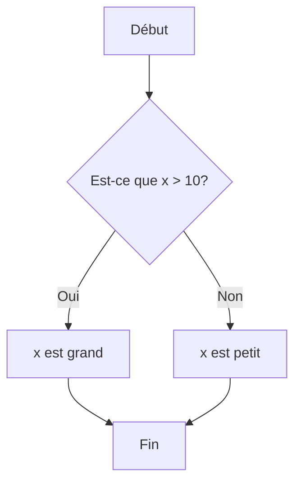
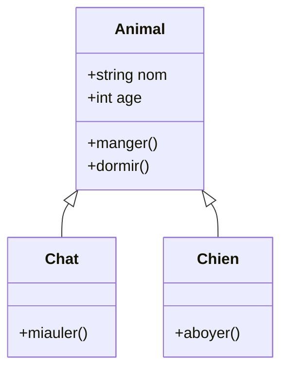
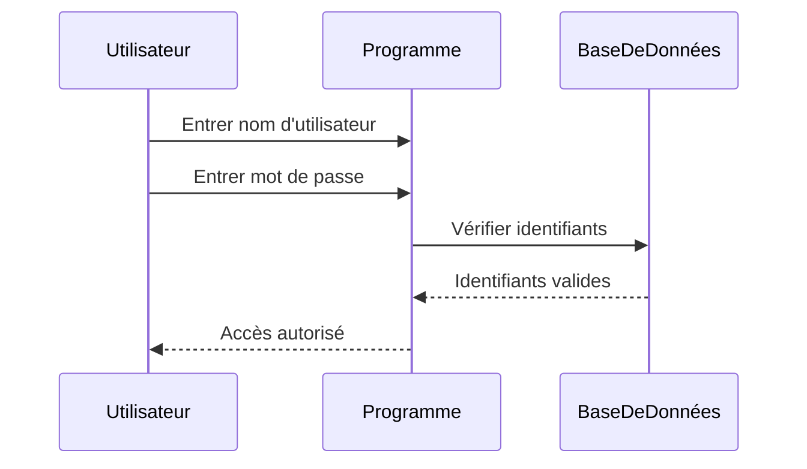
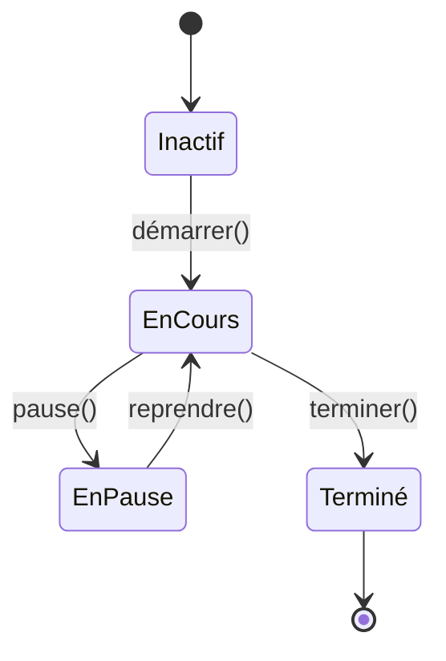
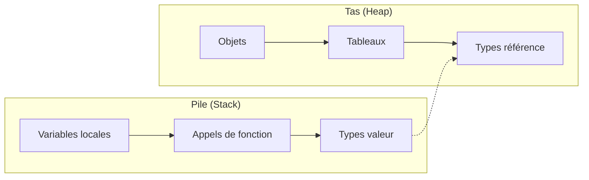
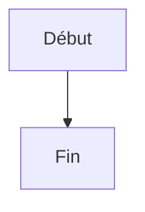

# Exemples de diagrammes Mermaid

Cette page démontre comment utiliser [Mermaid.js](https://mermaid.js.org/) pour créer des diagrammes dans le syllabus.

## Diagrammes de flux

Les diagrammes de flux sont utiles pour illustrer des algorithmes ou des processus.



## Diagrammes de classe

Les diagrammes de classe sont parfaits pour expliquer les concepts de programmation orientée objet.



## Diagrammes de séquence

Utiles pour montrer l'ordre des opérations et les interactions entre objets.



## Diagrammes d'état

Parfaits pour illustrer les différents états d'un objet ou d'un système.



## Diagramme d'organisation de la mémoire



## Comment utiliser Mermaid dans le syllabus

Pour créer un diagramme Mermaid dans une page Markdown, utilisez la syntaxe suivante :

```

```

Vous pouvez copier ces exemples et les adapter à vos besoins dans les différentes sections du syllabus.
